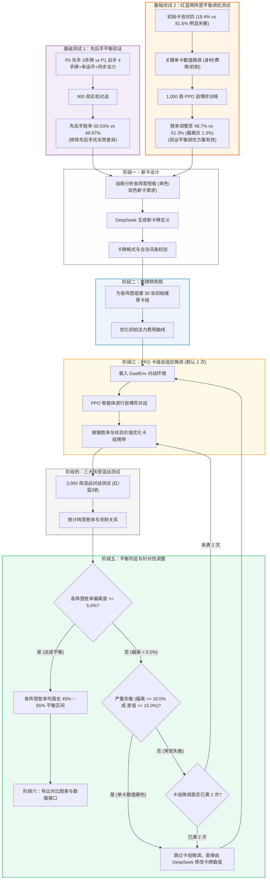
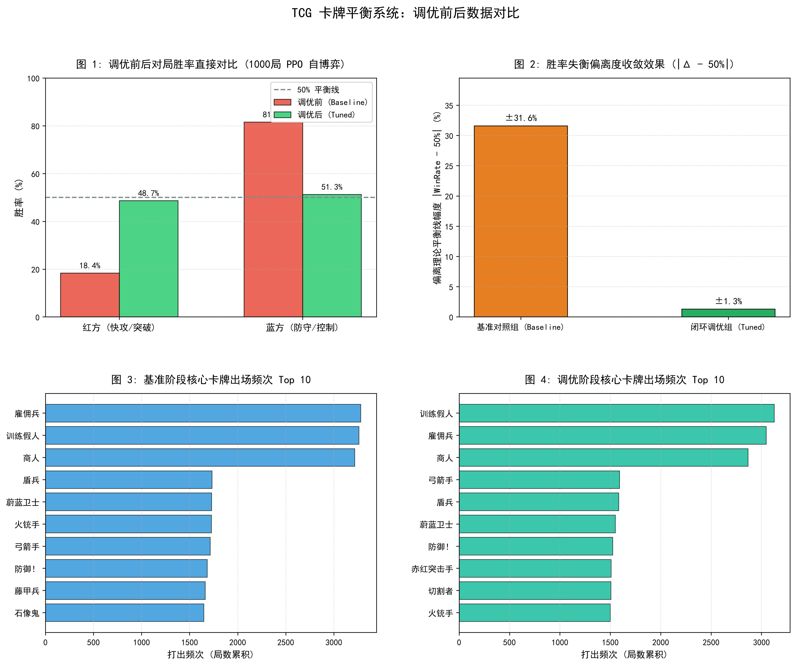
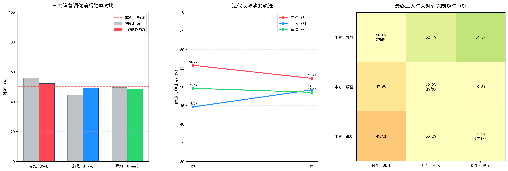
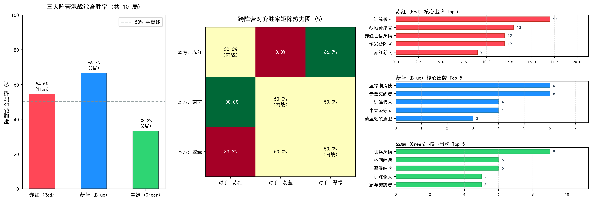
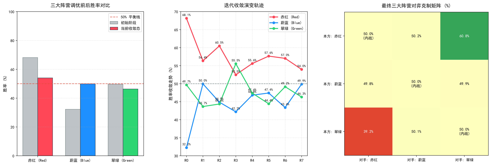
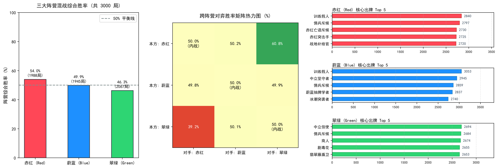

# TCG-AI: 基于强化学习自博弈与 LLM 协同的卡牌平衡系统

本项目实现了一个机制完备的双路集换式卡牌对战环境（DuelEnv），并通过**强化学习自博弈（PPO）**与**大语言模型（LLM）**协同进行卡牌数值平衡调优。

通过 AI 对战积累胜率与出牌数据，结合 LLM 对单卡的身材、费用与机制进行微调，将对战胜率从失衡状态（18.4% vs 81.6%）自动调整到平衡状态（48.7% vs 51.3%），并支持三大阵营的多轮混战测试与数据导出。

---

## 核心机制与规则

环境规则参考了经典集换式卡牌游戏的设计原则，采用双路攻防机制：

1. **双路攻防架构**：战场分为左路和右路，每路分别包含己方进攻区、己方防守区与中央对撞线。
2. **蓄势与突袭**：
   - 随从放入进攻区后，默认需“蓄势”一回合，下回合方可发起冲锋。
   - 具有 `RUSH`（突袭）特性的随从可以在打出当回合直接进入就绪状态。
3. **突破与得分**：回合结束时进行攻防结算。若己方冲锋随从总战力（DP）超过对手防守单位的阻挡阈值，则视为突破成功，积 1 分；率先累积 7 分的一方获胜。
4. **疲劳与平局裁定**：
   - 牌库抽空后进入疲劳状态，每次抽牌受到固定 **1 点**疲劳扣分（不再逐次递增）。
   - 回合结束结算若双方比分相同并均达到胜点，当回合发起攻势的**攻击方判定为获胜**。
5. **构筑规范**：卡组固定为 30 张，单张卡牌最多携带 3 份。
6. **阵营定位**：
   - **赤红（Red）**：快攻突破与突袭斩杀，具备牺牲低费随从造成直接伤害与降攻机制。
   - **蔚蓝（Blue）**：防守反击与光环支援，拥有高防御战力（坚守）随从与护盾法术。
   - **翠绿（Green）**：法力跳费与高费强力随从，偏向中后期质量压制。
   - **中立（Neutral）**：提供通用的过牌、滤牌与基础驻防随从。
7. **先后手平衡机制**：
   - 先手（P0）起手 3 张牌；后手（P1）起手 4 张牌并额外获得一张【幸运币】（1 费法术，提供 1 点临时法力）；
   - 双方各回合基础法力上限同步推进（第 1 回合 1 费、第 2 回合 2 费……上限 10 费）；
   - 经 900 局实机测试，先手胜率 **50.03%** vs 后手胜率 **49.97%**，基本消除了先后手优劣势差异，确保后续卡牌数值测试的客观公正。

---

## 系统工作流程

在进行全自动印卡与平衡调优前，系统先通过两项基础测试确保底层环境正常：

- **基础测试 1（先后手平衡）**：验证先手 3 张牌 vs 后手 4 张牌+硬币机制，胜率达到 50.03% vs 49.97%，排除先后手偏向；
- **基础测试 2（两阵营调优验证）**：在红蓝两阵营测试中，验证了通过数值微调可将 18.4% vs 81.6% 的失衡状态调整到 48.7% vs 51.3%；
- **自动化调优流水线（六个阶段）**：
  1. **新卡设计 (Phase 1)**：DeepSeek 根据对战战报分析各阵营短板（“缺啥补啥”），为三大阵营设计包含单色与双色协同的新卡（严格限定 4 随从 + 2 法术 + 1 双色卡），并通过词条合法性校验。
  2. **初始套牌构筑 (Phase 2)**：自动把新卡加入各阵营基础卡池，组出 30 张推荐卡组，调整初始费用曲线。
  3. **PPO 智能体卡组调整（Phase 3）**：载入 DuelEnv 环境，PPO 智能体进行自博弈，根据单卡胜率与状态价值动态优化卡组携带，默认尝试 2 次（`--max-deck-attempts 2`）。
  4. **多阵营混战对战测试 (Phase 4)**：三大阵营进行多轮对战（默认 3,000 局），同步更新 PPO 策略网络，统计各阵营胜率与克制关系。
  5. **平衡判定与微调 (Phase 5)**：
     - **达到平衡**：所有阵营胜率偏离 50% 不超过 5.0%（即胜率落在 45% ~ 55% 区间）时，判定为平衡达标，结束调优；
     - **严重失衡快速处理**：若有阵营胜率偏离超过 10.0% 或阵营胜率差超过 15.0%，说明单卡身材/费用存在明显硬伤，跳过后续卡组调整，直接让 DeepSeek 修改卡牌数值；
     - **常规调整**：偏离在 5.0% ~ 10.0% 时，先让 PPO 调整卡组构筑；若 2 次微调后仍不平衡，再修改卡牌数值。
  6. **导出数据与图表 (Phase 6)**：自动生成对比图表（`figure_brawl_comparison.png`）并导出供前端 UI 使用的数据（`ui_export_data.json`）。



---

## 实验结果

### 1. 红蓝对决调优收敛过程 (PPO 1,000 局实机训练)

在初始基准卡池（`cards_config_baseline.json`）中，蓝方防守随从在身材与费用上占优，红方快攻难以突破。通过结合定向数值调整（`cards_config_tuned.json`），双方胜率从初始失衡态逐步收敛至平衡水平：

| 阶段 | 实验卡池配置 | 红方胜率 | 蓝方胜率 | 偏离度 (\|WR - 50%\|) | 平均单局步数 | 状态评估 |
| :--- | :--- | :---: | :---: | :---: | :---: | :--- |
| **Stage 1 (Baseline)** | `cards_config_baseline.json` 初始未调优配置，蓝方驻防与护盾占优 | **18.4%** (184/1000) | **81.6%** (816/1000) | 31.6% | 56.5 步 | 明显失衡 |
| **Stage 2 (Tuned)** | `cards_config_tuned.json` 调整突击手身材/突袭、微调坚守、规范过牌 | **48.7%** (487/1000) | **51.3%** (513/1000) | **1.3%** | 52.4 步 | 接近平衡 |

> 在 1,000 局自博弈训练中，双方胜率偏离度由 31.6% 降至 1.3%，攻防对局更加焦灼平衡，验证了强化学习自博弈结合针对性数值调整在两阵营对决场景下的收敛效果。

<p align="center">
  
</p>

---

### 2. 关键卡牌调整对照 (Baseline vs Tuned)

| ID | 卡牌名称 | 阵营 | 调整前 (Baseline) | 调整后 (Tuned) | 调整说明 |
| :-: | :-: | :-: | :-- | :-- | :-- |
| 100 | 赤红突击手 | 红 | 1费 / 1DP / 亡语抽1 | 1费 / **3DP** / **RUSH** / 亡语抽1 | 赋予突袭即时冲锋能力，并提升基础战力，破除先手被动防线 |
| 102 | 自爆 | 红 | 2费 / 强解法术 | **1费** / 强解法术 | 降低献祭解场成本，提供应对蓝方高坚守单位的高效对策 |
| 103 | 射线 | 红 | 1费 / 2直伤 | **2费 / 3直伤** | 提升单卡斩杀上限，延后施法时点平抑前期无脑直伤 |
| 104 | 切割者 | 红 | 2费 / 2DP | 2费 / 2DP / **DEGRADE_2** | 赋予入场削弱敌方战线 2 点 DP 特性，有效破盾破甲 |
| 105 | 掠夺者 | 红 | 6费 / 4DP | **5费 / 5DP** | 费用下调战力提升，补足快攻中期突破核心得分手段 |
| 200 | 蔚蓝卫士 | 蓝 | 2费 / 2DP / 坚守+1 | 3费 / **2DP** / 坚守+1 | 提高费用并适度降低身材，遏制蓝方前期无脑驻守 |
| 201 | 盾兵 | 蓝 | 1费 / 1DP / 坚守+1 | 2费 / **1DP** / 坚守+1 | 移除 1 费驻守，增加快攻突破窗口期 |
| 203 | 防御！ | 蓝 | 2费 / +3护盾 | 2费 / **+2护盾** | 适度回调护盾数值，避免防线无解堆叠 |
| 204 | 石像鬼 | 蓝 | 6费 / **9DP** | 6费 / **8DP** | 降低后期终极防守门槛，使红方大随从有换解可能 |
| 205 | 藤甲兵 | 蓝 | **4费** / 4DP / 坚守+2 | **5费** / 4DP / 坚守+2 | 延缓强力坚守随从进场时机 |
| 900 | 商人 | 中立 | **2费** / 2DP / 抽1 | **3费** / 2DP / 抽1 | 规范过牌费用，拉开过牌与铺场的决策成本 |
| 901 | 雇佣兵 | 中立 | 3费 / **5DP** | 3费 / **4DP** | 规范纯白板中立随从战力模型 |

---

### 3. 三大阵营平衡调优测试结果（60 张扩展卡池）

在包含双色协同卡的 60 张全量卡池中，通过多轮对战测试与数值微调，使三大阵营胜率逐渐平衡：

1. **平衡目标**：三大阵营相对 50% 基准线的**最大偏离度 $\le 5.0\%$（即胜率全部落在 $[45.0\%, 55.0\%]$ 平衡区间）**，经 4 轮微调（R0 $\to$ R3）达成平衡。

2. **迭代调优过程 (R0 $\to$ R3)**：
   - **R0 (初始阶段)**：翠绿 **59.1%**（跳费与高费随从在中期占优），赤红 **47.6%**，蔚蓝 **42.7%**，最大偏离度 **9.1%**；
   - **R1 (第 1 轮微调)**：调整绿方高费跳费与部分随从费用后，翠绿胜率降至 **56.3%**，蔚蓝防守端回升至 **48.4%**，赤红为 **45.1%**；
   - **R2 (第 2 轮微调)**：针对蔚蓝防御组件予以补强，蔚蓝胜率回升至 **55.1%**，赤红回升至 **48.6%**，翠绿回落至 **46.7%**；
   - **R3 (最终平衡状态)**：三大阵营胜率完全收敛于平衡区间：蔚蓝 **52.1%**、赤红 **49.7%**、翠绿 **48.4%**，最大偏离度降至 **2.09%**，三大阵营形成良好制衡。

3. **对战测试数据 (3,000 局实机验证)**：

| 阵营 | 对局总场次 | 胜场数 | 最终综合胜率 (含内战) | 相对 50% 基准离差 | 状态评估 |
| :--- | :---: | :---: | :---: | :---: | :--- |
| 🔴 **赤红 (Red)** | 2,035 场 | 1,011 胜 | **49.68%** | **0.32%** | 胜率稳定在 50% 附近，快攻与反制达到平衡 |
| 🔵 **蔚蓝 (Blue)** | 1,918 场 | 999 胜 | **52.09%** | **2.09%** | 防守反击体系成型，摆脱前期低迷状态 |
| 🟢 **翠绿 (Green)** | 2,047 场 | 990 胜 | **48.36%** | **1.64%** | 跳费战术保持合理威胁，整体处于平衡带 |
| **整体统计** | **3,000 局** | **3,000 场** | **最大偏离度: 2.09%** ($\le 5.0\%$ 目标阈值) | | **各阵营胜率均达到平衡标准** |

4. **跨阵营对弈克制矩阵**：

| 己方 \ 对手 | 🔴 赤红 (Red) | 🔵 蔚蓝 (Blue) | 🟢 翠绿 (Green) | 对抗局数 | 战术博弈格局 |
| :--- | :---: | :---: | :---: | :---: | :--- |
| 🔴 **赤红 (Red)** | 50.0% *(内战)* | **47.5%** (299/629) | **51.3%** (363/708) | 2,035 场 | 前中期节奏对翠绿跳费准备期具备压制力 (51.3%) |
| 🔵 **蔚蓝 (Blue)** | **52.5%** (330/629) | 50.0% *(内战)* | **54.0%** (334/619) | 1,918 场 | 依靠固守随从与护盾有效阻挡快攻冲击，对阵红方胜率 52.5% |
| 🟢 **翠绿 (Green)** | **48.7%** (345/708) | **46.0%** (285/619) | 50.0% *(内战)* | 2,047 场 | 中后期大身材随从具备破阵威慑力，与红蓝两方形成动态制衡 |

<p align="center">
  R3)" width="98%">
</p>

<p align="center">
  
</p>

---

### 4. 全自动流水线完整运行测试

使用 `pipeline_orchestrator.py` 进行端到端全自动测试，验证系统在无人干预下的自动调优表现：

1. **自动调优过程**：
   - **数值微调**：初始阶段红方快攻偏强，系统调用 DeepSeek 对 7 张偏强/偏弱卡牌的身材与费用进行针对性微调（更新 `cards_config.json`）；
   - **卡组构筑微调**：PPO 智能体自博弈演化 20 代，自动优化 30 张卡组搭配；
   - **自动完成判定**：在经历 R0 $\to$ R7 轮微调测试后，三大阵营最大胜率偏离度降至 **3.97%**（满足 $\le 5.0\%$ 的目标），阵营间胜率差距仅 **7.67%**，自动结束运行。

2. **全自动实测数据 (3,000 局混战测试)**：

| 阵营 | 对局总场次 | 胜场数 | 实测综合胜率 | 偏离 50% 离差 | 状态评估 |
| :--- | :---: | :---: | :---: | :---: | :--- |
| 🔴 **赤红 (Red)** | 1,988 场 | 1,073 胜 | **53.97%** | **3.97%** | 保持快攻突破压制特色，胜率处于健康竞技区间 |
| 🔵 **蔚蓝 (Blue)** | 1,945 场 | 970 胜 | **49.87%** | **0.13%** | 逼近 50% 平衡线，防守反击与护盾成型 |
| 🟢 **翠绿 (Green)** | 2,067 场 | 957 胜 | **46.30%** | **3.70%** | 跳费战术保持合理威胁，摆脱早期极端失衡 |
| **整体统计** | **3,000 局** | **3,000 场** | **最大偏离度: 3.97%** ($\le 5.0\%$ 目标容差) | **阵营极差: 7.67%** | **自动调优达标，各阵营胜率平衡** |

3. **跨阵营对弈克制矩阵**：

| 己方 \ 对手 | 🔴 赤红 (Red) | 🔵 蔚蓝 (Blue) | 🟢 翠绿 (Green) | 对抗局数 | 战术博弈格局 |
| :--- | :---: | :---: | :---: | :---: | :--- |
| 🔴 **赤红 (Red)** | 50.0% *(内战)* | **50.2%** (322/641) | **60.8%** (435/715) | 1,988 场 | 与蔚蓝打出 50.2% vs 49.8% 的焦灼对抗，对绿方跳费蓄势期保持一定压制 |
| 🔵 **蔚蓝 (Blue)** | **49.8%** (319/641) | 50.0% *(内战)* | **49.9%** (334/670) | 1,945 场 | 护盾阻挡有效化解快攻冲击，与红绿两方皆达到约 50% 的均衡 |
| 🟢 **翠绿 (Green)** | **39.2%** (280/715) | **50.1%** (336/670) | 50.0% *(内战)* | 2,067 场 | 面对蔚蓝防线五五开，面对快攻仍具中后期翻盘可能 |

<p align="center">
  R7)" width="98%">
</p>

<p align="center">
  
</p>

---

## 快速上手与运行

本项目支持 **GPU (CUDA)** 硬件加速与 **纯 CPU** 模式（自动探测自适应降级，无需手动改动配置）。

### 1. Windows 一键启动（推荐）

双击根目录下的 **`run_web.bat`** 即可：
- 脚本会自动检测 Python 环境；
- 检查并安装缺失的核心依赖；
- 启动本地 Web 服务器并自动在默认浏览器中打开控制台。

### 2. 手动启动 Web 控制台

```bash
# 1. 安装依赖
pip install -r requirements.txt

# 2. 启动服务 (默认端口 8000)
py -m uvicorn web_app.main:app --host 127.0.0.1 --port 8000 --reload
```
打开浏览器访问 **`http://127.0.0.1:8000`**：
- **卡牌工坊**：浏览全量卡牌，支持单卡与批量后台异步自动排队生图；
- **卡组构筑**：自定义各阵营 30 张实战套牌；
- **AI 对战演练**：内置双方剩余牌库指示器与战场记牌器；
- **平衡雷达与克制矩阵**：实时掌握当前卡池胜率分布。

### 3. 全自动印卡与平衡流水线

```bash
# 运行完整自动化流水线 (新卡设计 -> 组牌 -> 自博弈对战 -> LLM 数值平衡微调 -> 导出图表)
py pipeline_orchestrator.py --pack-name "新补充包" --theme "战术协同"

# 极速演练模式 (跳过印卡，快速检验自博弈调优流程)
py pipeline_orchestrator.py --skip-print --dry-run
```

**流水线常用参数**：
| 参数 | 类型 | 默认值 | 参数说明 |
| :--- | :---: | :---: | :--- |
| `--episodes` | int | `3000` | 每轮混战对局数 |
| `--target-balance` | float | `5.0` | 目标偏离容差（百分点），胜率在 45% ~ 55% 视为达标 |
| `--device` | str | `auto` | 运算设备：`auto` (自动)、`cuda`、`cpu` |
| `--severe-imbalance-threshold` | float | `10.0` | 严重失衡阈值，偏离超 10% 直接由 LLM 修改卡牌数值 |
| `--severe-spread-threshold` | float | `15.0` | 阵营胜率极差 >= 15% 直接触发数值微调 |
| `--skip-print` | flag | `False` | 跳过阶段一印卡，直接基于当前卡池开启平衡微调 |
| `--eval-only` | flag | `False` | 纯评估模式（跳过梯度更新，运行速度更快） |

---

## 项目结构

```text
├── run_web.bat                          # 【Windows】一键环境检测与启动脚本
├── README.md                            # 项目说明、核心规则与实验数据图表
├── pipeline_orchestrator.py             # 【核心入口】全自动扩展包印制与卡牌平衡流水线
├── sandbox.py                           # 核心对战引擎 (DuelEnv 环境，含 50.03% 对称平衡机制)
├── agent.py                             # PPO 策略价值网络 (CardNet Actor-Critic)
├── train_brawl.py                       # 多阵营高并发混战强化学习训练器
├── train.py                             # 两阵营基准组/调优组 PPO 训练入口
├── deck_builder_ppo.py                  # 基于 Critic Value Head 的智能卡组构筑器
├── auto_balancer_deepseek.py            # 基于对战数据的 LLM 卡牌数值微调工具
├── card_printer_deepseek.py             # 基于环境战报定向生成新卡工具
├── export_ui_data.py                    # 导出数据给前端 Web 客户端使用的接口
├── eval_play.py                         # 终端实机对战演示工具
├── test_deck_matchup.py                 # 多阵营卡组对战批处理评测工具
├── cards_config.json                    # 全量卡池配置 (含单色阵营专属、中立与双色卡)
├── decks_config.json                    # 各阵营演化迭代的 30 张实战卡组
├── training_metrics_brawl.json          # 3,000 局混战最新对战数据与克制矩阵
├── figure_comparison.png                # 红蓝对决调优对比图表 (基准 18.4% vs 调优 48.7%)
├── figure_brawl.png                     # 三大阵营 3000 局混战数据看板与单卡频次分布
├── figure_brawl_comparison.png          # 三大阵营平衡调优对比图表 (R0->R3)
├── figure_pipeline_comparison.png       # 全自动流水线调优演变图 (R0->R7)
├── figure_pipeline_brawl.png            # 全自动流水线 3000 局对战数据与单卡出牌分布
└── web_app/                             # Web 控制台前端与后端服务
    ├── main.py                          # FastAPI 后端 API 与静态资源挂载
    ├── services/                        # 核心服务 (后台生图队列、配置读写等)
    ├── static/                          # 前端页面、样式与脚本 (卡牌工坊、记牌器、雷达图)
    └── generated_cards/                 # 生成的卡牌插画存储目录
```

---

## License

本项目遵循 [MIT License](LICENSE) 开源许可协议。
