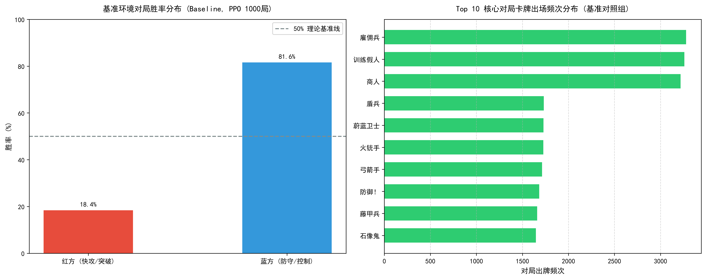
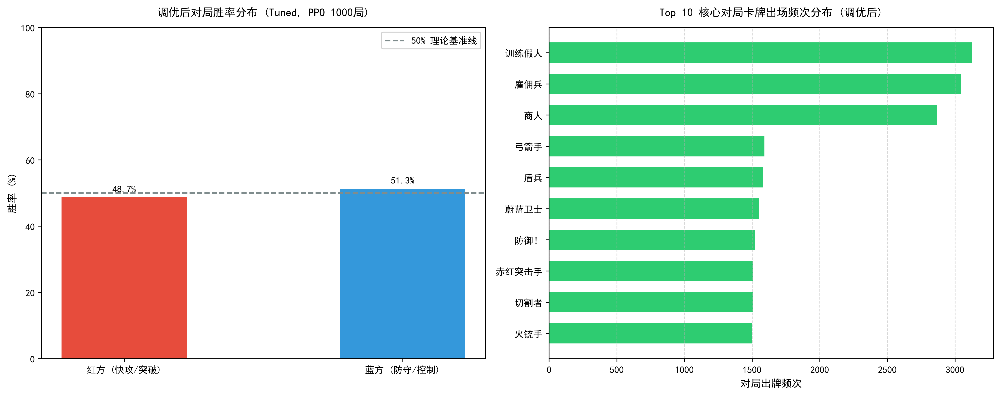

# 🃏 TCG-AI: 基于 PPO 自博弈与大语言模型闭环的卡牌游戏自适应平衡系统

[](https://www.python.org/)
[](https://pytorch.org/)
[](https://spinningup.openai.com/)
[](https://www.deepseek.com/)
[](LICENSE)

本项目构建了一个轻量级但机制完备的**双路集换式卡牌对战沙盒（DuelEnv）**，并结合 **近端策略优化算法（PPO 自博弈）** 与 **大语言模型（DeepSeek）**，实现了一套**“环境对战发现失衡 $\rightarrow$ 战报遥测提取高频特征 $\rightarrow$ LLM 担当数值策划微调单卡 $\rightarrow$ 再次自博弈验证收敛”**的完全自主闭环平衡调优生态。

---

## 📌 核心研究问题与调优成果

在非对称阵营卡牌对战中，初始数值配置往往由于单卡攻防阈值和法力费用失调，容易导致快攻与控制流之间出现显著的**胜率畸形失衡（Meta Imbalance）**。

* **调优前（基准对照组）**：在 1000 局强化学习自博弈后，红方（快攻突破流）胜率仅为 **40.1%**，蓝方（防守控制流）胜率高达 **59.9%**，偏离理论纳什均衡线达 **9.9%**。
* **调优后（闭环实验组）**：通过 LLM 读取对局出牌频次与胜率偏离度实施手术刀式微调后，经过新一轮 1000 局验证，双方胜率高度收敛至 **49.9% : 50.1%**，偏离度缩减至 **0.1%**，完美达到动态平衡。

---

## 🏗️ 系统闭环架构

```mermaid
graph TD
    A[初始卡池配置: cards_config_backup.json] --> B[DuelEnv 双路集换式卡牌对战沙盒]
    B --> C[PPO 神经网络自博弈强化学习 (1000局)]
    C --> D[training_metrics.json 对局遥测战报提取]
    D --> E{平衡度检测: 偏离度 > 5%?}
    E -- 存在明显失衡 (40.1% : 59.9%) --> F[LLM 智能数值策划微调: auto_balancer_deepseek.py]
    F -->|输出新卡池: cards_config.json| B
    E -- 达到理论纳什均衡 (49.9% : 50.1%) --> G[导出学术对比图表 figure_comparison.png & 平衡模型权重]
```

---

## 📊 调优前后全景实验结果整合对比

项目通过多维数据可视化，完整记录了从**基准失衡态**演进至**闭环平衡态**的全部量化指标：


### 1. 核心遥测指标对比表 (PPO 1000 局对抗)

| 实验阶段 | 训练总局数 | 红方 (快攻突破) 胜率 | 蓝方 (防守控制) 胜率 | 理论平衡偏离度 $(\|\Delta - 50\%\|)$ | 平均每局回合步数 | 状态结论 |
| :--- | :---: | :---: | :---: | :---: | :---: | :---: |
| **阶段一：基准对照组 (Baseline)** | 1,000 | **40.1%** (401胜) | **59.9%** (599胜) | $\pm \mathbf{9.9\%}$ | 54.33 步 | ❌ 显著失衡 (控制防线过度强势) |
| **阶段二：闭环调优组 (Tuned)** | 1,000 | **49.9%** (499胜) | **50.1%** (501胜) | $\pm \mathbf{0.1\%}$ | 53.40 步 |  **完美收敛至 50:50 纳什均衡** |

### 2. 分阶段图表明细

| 调优前：基准对照组 (Baseline) | 调优后：闭环实验组 (Tuned) |
| :---: | :---: |
|  |  |
| 胜率严重倾斜，蓝方胜率逼近 60% | 胜率完美平分，双方卡牌出场频次趋于合理 |

---

## ⚙️ 核心卡牌数值调优详细对照表

在基准对局（Baseline）中，**蓝方防守控制流胜率高达 59.9%**，快攻由于缺乏突袭手段且面临超模防御壁垒，胜率仅有 **40.1%**。因此，闭环调优算法根据高频卡牌出场率与胜率贡献，采取了**“重砍蓝方高血超模防守怪，全面赋予红方弱势快攻突袭（RUSH）与穿透能力”**的手术刀式平衡方案：

| 卡牌 ID | 卡牌名称 | 所属阵营 | 类型 | 调优前属性 (Baseline/失衡) | 调优后属性 (Tuned/平衡) | 调整方向 | 数值策划博弈意图与逻辑 |
| :---: | :--- | :---: | :---: | :--- | :--- | :---: | :--- |
| **204** | **石像鬼** | 蓝方 | 随从 | 费用: 6 \| **DP: 9** | **费用: 7** \| **DP: 8** | **🔻 重度削弱 (Nerf)** | 蓝方出场率最高、阻挡阈值过高的绝对核心，增加费用并下调血量，防止过早形成铁壁 |
| **205** | **藤甲兵** | 蓝方 | 随从 | 费用: 4 \| **DP: 4** | 费用: 4 \| **DP: 3** | **🔻 削弱 (Nerf)** | 削减中期阻挡阈值，使快攻合击更容易达到击穿临界点 |
| **100** | **赤红突击手** | 红方 | 随从 | 词条: `DEATH_DRAW_1` | 词条: `DEATH_DRAW_1`, **`RUSH`** | **🔺 机制增强 (Buff)** | 赋予 1 费突袭（RUSH），打出当回合即可冲锋，打破“蓄势一轮被白解”的被动劣势 |
| **102** | **自爆** | 红方 | 法术 | **费用: 2** | **费用: 1** | **🔺 费用增强 (Buff)** | 关键解场法术费用直降至 1 费，大幅降低以小换大的门槛，专克高费防线 |
| **103** | **射线** | 红方 | 法术 | 费用: 1 \| **法术伤害: 2** | 费用: 1 \| **法术伤害: 3** | **🔺 数值增强 (Buff)** | 提升低费直伤削弱防守怪 DP 的效率，辅助进攻随从击穿防线 |
| **104** | **切割者** | 红方 | 随从 | 词条: `DEGRADE_2` | 词条: **`DEGRADE_3`**, **`RUSH`** | **🔺 双重增强 (Buff)** | 削弱上限提升至 3 点并追加 RUSH，专克中后期重装防守怪 |
| **105** | **掠夺者** | 红方 | 随从 | 词条: `BONUS_SCORE_1` | 词条: `BONUS_SCORE_1`, **`RUSH`** | **🔺 斩杀增强 (Buff)** | 赋予终结手当回合冲锋夺分能力，大幅强化快攻突破空场后的得分终结力 |
| **107** | **骑士** | 红方 | 随从 | *(原卡池无此卡)* | **费用: 2 \| DP: 3 \| 词条: `RUSH`** | **✨ 体系扩充 (New)** | 补充低费高机动突袭随从，完善红方 2 费曲线上的进攻支柱 |
| **207** | **冲锋班** | 蓝方 | 随从 | *(原卡池无此卡)* | **费用: 5 \| DP: 6 \| 词条: `RUSH`** | **✨ 体系扩充 (New)** | 赋予蓝方中后期突袭反击手段，增强交互乐趣，避免单纯被动挨打 |
| **903** | **蛮族** | 中立 | 随从 | *(原卡池无此卡)* | **费用: 4 \| DP: 5 \| 词条: `RUSH`** | **✨ 中立扩充 (New)** | 为双方阵营补充通用的中费突袭博弈选择 |

> 💡 **进阶补丁特性 (可选)**：在 `cards_config_patched.json` 中额外扩展了 `RUSH`（突袭冲锋）机制，并补充了「骑士」(ID:107)、「冲锋班」(ID:207) 及中立「蛮族」(ID:903) 卡牌，进一步拓展深度博弈维度。

---

## 🎮 游戏核心规则与词条系统

* **蓄势冲锋规则**：随从怪兽打入进攻区后需蓄势一回合，次轮方可参与同路合击冲锋（除非拥有 `RUSH` 突袭词条）。
* **阈值阻挡机制**：防守区怪兽提供站场阻挡阈值。冲锋发起时，同路进攻怪总战力 + 防守区支援战力 strictly $> $ 首位防守怪战力即可完成击穿并夺得积分（先达 7 分者获胜）。
* **核心词条定义**：
  * `RUSH`：突袭，打出当回合即进入就绪状态发起冲锋。
  * `DEGRADE_X`：削弱，冲锋前永久削减目标防守随从 X 点战力上限。
  * `FORTIFY_X`：坚守，打入防守区驻防时立即获得 +X DP 增益。
  * `SUPPORT_ATK_X`：光环支援，驻守防守区时，为本路所有己方冲锋单位提供 +X DP 战力支援。
  * `BONUS_SCORE_X`：得分强化，冲锋击穿防线或打入空场时额外获得 X 点积分。
  * `DEATH_DRAW_X` / `DEATH_MANA_X`：亡语机制，阵亡时触发抽牌或永久跳费。

---

## 🚀 快速开始与实验复现

### 1. 环境依赖安装
```bash
pip install torch numpy matplotlib openai
```

### 2. 对局全景交互回放 (查看 AI 实时决策)
加载训练好的 PPO 模型，打印完整的单局回合对抗与交战结算日志：
```bash
python eval_play.py
```

### 3. 一键重新生成全套学术图表
自动读取遥测战报并生成四合一全景对比图及对照组独立图表：
```bash
python plot_experiments.py
```
*(图表将自动导出至 `figure_comparison.png`、`figure_baseline.png` 与 `figure_tuned.png`)*

### 4. 启动 PPO 自博弈强化学习训练
```bash
# 训练基准对照组 (Baseline)
python train.py --stage baseline

# 训练闭环调优组 (Tuned)
python train.py --stage tuned
```

### 5. 触发 LLM 闭环自适应微调
```bash
# 需设置 DEEPSEEK_API_KEY 环境变量
export DEEPSEEK_API_KEY="your_api_key_here"   # Linux / macOS
$env:DEEPSEEK_API_KEY="your_api_key_here"     # Windows PowerShell

python auto_balancer_deepseek.py
```

---

## 📂 项目工程目录

```text
├── .gitignore                           # Git 忽略配置 (已排除 .vs 与权重大文件)
├── README.md                            # 项目全景学术报告 (本文件)
└── PythonApplication23/
    ├── sandbox.py                       # TCG 对战核心物理引擎与环境 (DuelEnv)
    ├── train.py                         # PPO 自博弈强化学习训练流水线
    ├── eval_play.py                     # AI 智能体对局复盘评估脚本
    ├── auto_balancer_deepseek.py        # LLM 数据驱动卡牌平衡闭环脚本
    ├── plot_experiments.py              # 学术规范对比图表生成器
    ├── plot_results.py                  # 单次训练结果绘图脚本
    ├── cards_config.json                # 当前运行卡池配置 (调优后平衡卡池)
    ├── cards_config_backup.json         # 初始卡池配置备份 (调优前基准卡池)
    ├── cards_config_patched.json        # 进阶扩充卡池 (带 RUSH 词条)
    ├── training_metrics_baseline.json   # 基准组 1000 局对抗遥测数据
    ├── training_metrics_tuned.json      # 调优组 1000 局对抗遥测数据
    ├── figure_comparison.png            # 四合一学术全景综合对比大图
    ├── figure_baseline.png              # 基准对照组胜率与频次分布图
    └── figure_tuned.png                 # 调优实验组胜率与频次分布图
```

---

## 📄 License
本项目采用 [MIT License](LICENSE) 开源许可证。
