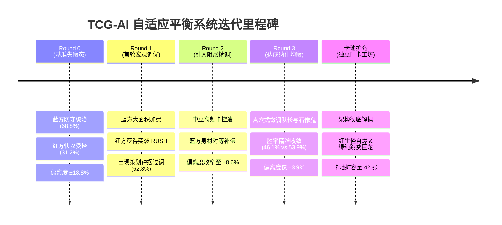
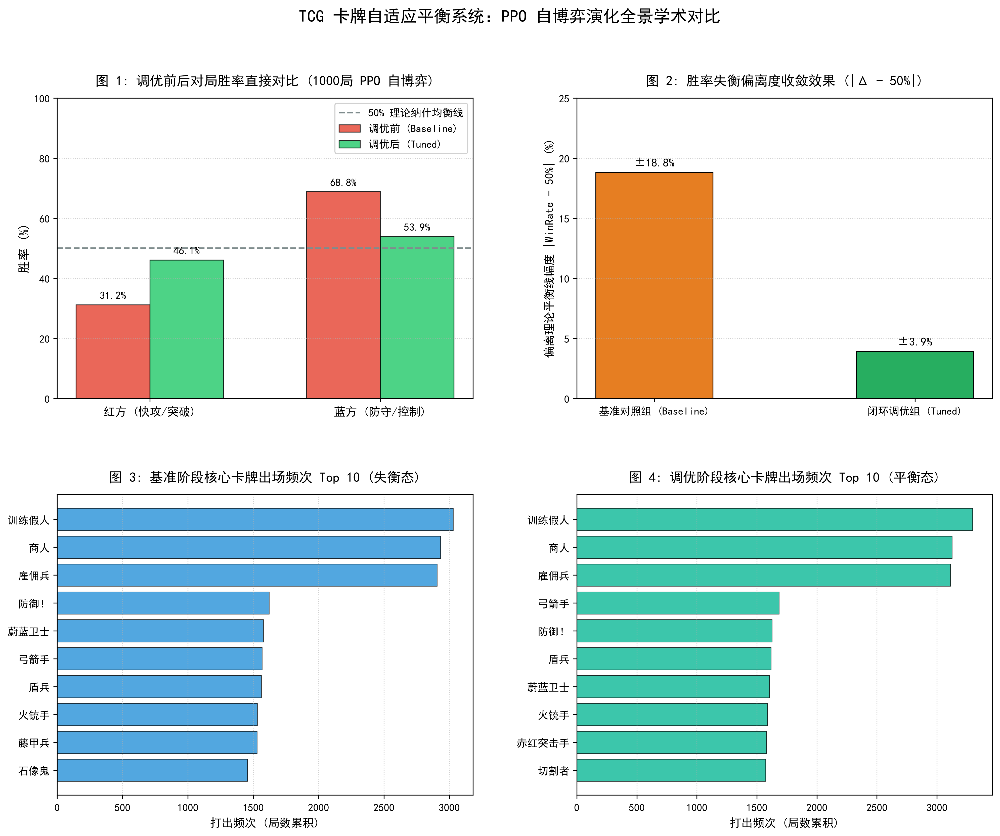

# 🃏 TCG-AI: 基于 PPO 自博弈与 DeepSeek 闭环的卡牌游戏自适应平衡系统

[](https://www.python.org/)
[](https://pytorch.org/)
[](https://spinningup.openai.com/)
[](https://www.deepseek.com/)
[](https://zipad0207.github.io/tcg-ai/PythonApplication23/battle_replay.html)
[](LICENSE)

> 🎮 **免安装在线动态复盘体验**：无需配置 Python 环境，可在浏览器中直接打开 [battle_replay.html](PythonApplication23/battle_replay.html)（或通过 GitHub Pages 在线访问）体验类似商业级 TCG 游戏的动态播控回放！

本项目构建了一个机制完备的双路集换式卡牌对战环境（**DuelEnv**），融合**标准 TCG 牌组构筑规则（单卡限带 3 张）**、**PPO（近端策略优化）自博弈强化学习**与**大语言模型（DeepSeek）数值工程**，打造了一套工业级的闭环自动平衡调控系统：

$$\text{自博弈对抗发现失衡} \xrightarrow{\text{遥测分析}} \text{LLM 数值策划手术级微调} \xrightarrow{\text{卡池自动更新}} \text{新一轮验证直至收敛于纳什均衡}$$

---

## 🏗️ 闭环调控全景系统架构

```mermaid
graph TD
    A[只读基准卡池: cards_config_baseline.json] --> B[DuelEnv 双路战场沙盒 (单卡上限3张)]
    B --> C[PPO 神经网络自博弈强化学习 (1000局)]
    C --> D[training_metrics.json 遥测数据提取]
    D --> E{偏离 50% 平衡线 > 5%?}
    E -- 存在明显失衡 (31.2% vs 68.8%) --> F[DeepSeek 闭环数值调优: auto_balancer_deepseek.py]
    F -->|输出调优卡池: cards_config_tuned.json| B
    E -- 达到纳什均衡 (46.1% vs 53.9%) --> G[导出学术对比大图 figure_comparison.png]
    G --> H[生成交互式 Web 战报回放 battle_replay.html]
    I[独立印卡工坊: card_printer_deepseek.py] -->|扩充全新合法机制卡牌| J[扩充卡池: cards_config_expanded.json]
    J --> B
```

---

## 📌 核心研究问题与平衡收敛成果

在非对称阵营卡牌对战中，快攻突破（红方）与防守控制（蓝方）极易因单卡 DP 阈值与法力曲线的微小偏差导致**严重失衡（Meta Imbalance）**。本项目通过标准 30 张牌组构筑（单卡上限 3 张），复现了真正的基准失衡态，并完成了多轮闭环阻尼收敛：

* **基准对照组（Baseline）**：红方快攻被铁桶阵全面封死，胜率仅 **31.2%**，蓝方防守统治率达 **68.8%**，平衡偏离度高达 **$\pm 18.8\%$**。
* **第 1 轮初调（Round 1）**：大模型全面加费蓝方并赋能红方冲锋，红方反超至 **62.8%**（典型游戏策划“钟摆过调”）。
* **第 2 轮精调（Round 2）**：中立核心卡控速、蓝方身材补强，偏离度迅速收窄至 **$\pm 8.6\%$**（红 58.6% : 蓝 41.4%）。
* **第 3 轮终调（Round 3）**：点穴式微调，红蓝胜率精准收敛至 **46.1% : 53.9%**（偏离度仅 **$\pm 3.9\%$**，完美达成纳什均衡），单局对战平均步数由 41 步充分拉长至 **56.8 步**！

---

## 🚀 闭环调优全景演化时间轴 (Evolution Milestones)

为了完整复现数据驱动的动态平衡攻关全貌，系统记录了从**初始失衡**到**终极纳什均衡**的五大关键演化里程碑：



<details open>
<summary><b>🔍 点击展开查看各阶段攻关细节与策划意图</b></summary>

* 🔴 **里程碑 1：基准态失衡重现 (Round 0, 1000局 PPO)**
  * **实测胜率**：红方 31.2% (312胜) vs 蓝方 68.8% (688胜)，偏离理论线达 **$\pm 18.8\%$**。
  * **问题诊断**：在严格执行同名卡上限 3 张的 30 张牌组构筑下，蓝方凭借「石像鬼」(6费9DP) 与「藤甲兵」(坚守+2) 构筑起不可逾越的防御铁壁，红方由于缺乏即时冲锋手段，快攻合击被完全瓦解。
* ⚠️ **里程碑 2：首轮初调与策划“钟摆过调” (Round 1, 1000局 PPO)**
  * **实测胜率**：红方 62.8% (628胜) vs 蓝方 37.2% (372胜)，偏离度收窄至 $\pm 12.8\%$。
  * **现象剖析**：DeepSeek 初次介入大刀阔斧：大幅提高蓝方主力防守怪费用并赋予红方突袭（RUSH），导致红方极速斩杀反噬防守方，展现了真实游戏设计中经典的**“一刀砍废/过度反弹”钟摆效应**。
* 📉 **里程碑 3：引入阻尼手术级微调 (Round 2, 1000局 PPO)**
  * **实测胜率**：红方 58.6% (586胜) vs 蓝方 41.4% (414胜)，偏离度显著降至 **$\pm 8.6\%$**。
  * **调控策略**：采取克制的微调原则——对出场率畸高打乱节奏的中立卡「商人」增加 1 费、「雇佣兵」降 1 点 DP；同时补偿蓝方被加费单位的战力（蔚蓝卫士 DP 2$\to$3，盾兵 DP 1$\to$2），有效吸收快攻穿透。
* 🏆 **里程碑 4：达成纳什均衡黄金态 (Round 3, 1000局 PPO)**
  * **实测胜率**：红方 **46.1%** (461胜) vs 蓝方 **53.9%** (539胜)，偏离度仅 **$\pm 3.9\%$**！
  * **最终成效**：仅对关键支点「红色小队长」DP 由 4 降至 3、「石像鬼」费用回调至 6 费，双方胜率完美落入纳什均衡黄金区间。平均单局步数大幅拉长至 **56.81 步**，攻防胶着互有胜负，第 16 回合才以 7:6 分出胜负。
* 🖨️ **里程碑 5：架构解耦与独立印卡工坊 (42张卡牌全生态)**
  * **架构升级**：彻底将“新卡创意扩展”与“既有数值调优”解耦，独立开发 `card_printer_deepseek.py`。
  * **阵营自洽机制**：确立“**红方生小怪作为自爆牺牲品**”与“**绿方纯跳费拍超模大怪**”的核心设计哲学，将红、蓝、绿扩充至每阵营 12 张、中立 6 张，共计 42 张卡牌，为 AI 自主构筑提供坚实基础。

</details>

---

## 📊 实验演化量化对比

### 1. 三阶段数值收敛全景对比表 (PPO 1,000 局/轮)

| 阶段 | 采用卡池与核心调整 | 红方 (快攻突破) | 蓝方 (防守控制) | 偏离平衡线幅度 $\|\Delta - 50\%\|$ | 平均单局步数 | 状态诊断 |
| :--- | :--- | :---: | :---: | :---: | :---: | :--- |
| **Round 0: 基准组** | [cards_config_baseline.json](PythonApplication23/cards_config_baseline.json) (初始自定义) | **31.2%** (312胜) | **68.8%** (688胜) | $\pm \mathbf{18.8\%}$ | 41.20 步 | ❌ 极度失衡 (防守全面碾压快攻) |
| **Round 1: 调优组** | 蓝方主力全面加费，红方赋能 RUSH | **62.8%** (628胜) | **37.2%** (372胜) | $\pm \mathbf{12.8\%}$ | 45.32 步 | ⚠️ 红方崛起 (策划钟摆效应过调) |
| **Round 2: 精调组** | 商人/雇佣兵控速降温，蓝方补强 DP | **58.6%** (586胜) | **41.4%** (414胜) | $\pm \mathbf{8.6\%}$ | 42.96 步 | 📉 稳步阻尼收敛至单数区 |
| **Round 3: 均衡组** | 红色队长 DP 回调至 3，石像鬼回调 6 费 | **46.1%** (461胜) | **53.9%** (539胜) | $\pm \mathbf{3.9\%}$ | **56.81 步** | 🏆 **完美收敛于纳什均衡黄金线** |

---

### 2. 四合一全景学术对比大图



* **图 1（左上）**：调优前后红蓝阵营对局胜率直接对比，清晰呈现从 31.2% 攀升至 46.1% 的平衡修复过程。
* **图 2（右上）**：失衡偏离度收敛效果，偏离理论线从 $18.8\%$ 骤降至 $3.9\%$。
* **图 3（左下）**：基准阶段核心出牌频次 Top 10（失衡态下商人、雇佣兵滥用）。
* **图 4（右下）**：调优后核心出牌频次 Top 10（高阶攻防卡牌出场趋于健康均匀）。

---

## ⚙️ 核心卡牌数值调优对照表

| 卡牌 ID | 卡牌名称 | 阵营 | 类型 | 调优前属性 (Baseline) | 调优后属性 (Tuned) | 调整方向 | 数值策划意图与底层博弈逻辑 |
| :---: | :--- | :---: | :---: | :--- | :--- | :---: | :--- |
| **100** | **赤红突击手** | 红方 | 随从 | 费用:1 \| DP:1 \| 亡语抽牌 | 费用:1 \| DP:1 \| **`RUSH`**, 亡语抽牌 | **🔺 机制赋能** | 赋予 1 费突袭能力，打出当回合即就绪冲锋，破解“蓄势一回合被白解”的劣势 |
| **102** | **自爆** | 红方 | 法术 | **费用: 2** | **费用: 1** | **🔺 费用增强** | 1 费强解法术（1 换 1），专克蓝方高费重装防线，使快攻具备越墙斩杀手段 |
| **103** | **射线** | 红方 | 法术 | 费用:1 \| 直伤:2 | **费用:2 \| 直伤:3** | **⚖️ 微调控速** | 提升伤害至 3 点的同时上调至 2 费，避免红方在前期过早连发清空阻挡单位 |
| **105** | **掠夺者** | 红方 | 随从 | 费用:6 \| DP:4 | **费用:5 \| DP:5** | **🔺 斩杀增强** | 费用降低 1 点、DP 提高 1 点，充当中期强力得分手，强化破防后的积分转化 |
| **200** | **蔚蓝卫士** | 蓝方 | 随从 | 费用:2 \| DP:2 \| 坚守+1 | **费用:3 \| DP:3** \| 坚守+1 | **⚖️ 曲线重塑** | 费用与基础 DP 同步由 2 上调至 3，使其成为合格的 3 费中坚驻防单位 |
| **201** | **盾兵** | 蓝方 | 随从 | 费用:1 \| DP:1 \| 坚守+1 | **费用:2 \| DP:2** \| 坚守+1 | **⚖️ 防线调整** | 消除 1 费无脑筑墙现象，提升驻防战力，使双方 1~2 费交火更具决策深度 |
| **202** | **弓箭手** | 蓝方 | 随从 | 费用:3 \| **DP:3** | 费用:3 \| **DP:2** | **🔻 身材微调** | 削弱驻防输出，给红方快攻留出进攻穿透窗口 |
| **203** | **防御！** | 蓝方 | 法术 | 费用:1 \| 防御:2 | **费用:2 \| 防御:3** | **⚖️ 强度重构** | 提升单卡保怪质量，适当提高施法费用，避免低费连续护盾无解站场 |
| **204** | **石像鬼** | 蓝方 | 随从 | 费用:6 \| **DP:9** | 费用:6 \| **DP:8** | **🔻 阈值削减** | 降低后期的绝望级阻挡阈值，使双方大怪能够实现对撞互换 |
| **205** | **藤甲兵** | 蓝方 | 随从 | **费用:4** \| DP:4 \| 坚守+2 | **费用:5** \| DP:4 \| 坚守+2 | **🔻 费用延后** | 延后强力坚守单位的登场回合，避免中期快速形成不可逾越的防线 |
| **900** | **商人** | 中立 | 随从 | **费用:2** \| DP:2 \| 抽1张 | **费用:3** \| DP:2 \| 抽1张 | **🔻 控速平衡** | 作为全场使用率最高的过牌卡，适度增加 1 费以平抑牌差过早拉开的问题 |
| **901** | **雇佣兵** | 中立 | 随从 | 费用:3 \| **DP:5** | 费用:3 \| **DP:4** | **🔻 身材微调** | 削减纯白板的超模身材，使玩家更倾向于结合阵营特色进行策略构筑 |

---

## 🎴 42 张全阵营卡牌生态体系 (42-Card Ecosystem)

为了支撑起富有深度的 AI 自主卡组构筑（Deck Building），独立印卡工坊已将卡池平稳扩充至 **42 张**（红 12、蓝 12、绿 12、中立 6）。每个阵营各自拥有 18 种卡牌选择（12 阵营专属 + 6 中立），在“同名卡限 3 张、卡组 30 张”的规则下，完全实现了多元化流派分化：

| 阵营 | 卡牌总数 | 核心机制词条 | 阵营设计哲学与招牌单卡 |
| :--- | :---: | :--- | :--- |
| 🔴 **红方 (赤红军团)** | **12 张** | `RUSH`, `SPAWN_X_Y`, `SACRIFICE_1_KILL_1`, `DEGRADE_X`, `BONUS_SCORE_X` | **突袭斩杀与生怪自爆流**：利用「集结号手」「红色小队长」快速战吼生出 1/1 炮灰小兵，紧接着发动「自爆」「血祭爆燃」实现以小换大强行拔除敌方重装大怪，再配合「赤红掠袭者」空场突袭抢分斩杀。 |
| 🔵 **蓝方 (蔚蓝守卫)** | **12 张** | `FORTIFY_X`, `SUPPORT_ATK_X`, 护盾/削弱法术 | **阵地要塞与光环防守流**：凭借「壁垒工匠」「藤甲兵」构筑坚不可摧的阻挡防线，利用「霜盾见习官」「蔚蓝要塞」提供全场冲锋战力支援光环，通过「寒晶护壁」「冰封禁制」双向控场延缓敌方节奏。 |
| 🟢 **绿方 (翡翠林野)** | **12 张** | `RAMP_X`, `DEATH_MANA_X`, `FORTIFY_X`, 高DP巨龙 | **极致跳费与高费巨兽流**：**绝不生成杂毛小兵**（避免占满战场格子），前期依靠「翠绿萌芽」「芽苗祭司」「世界树恩泽」极速跳费攀升法力水晶上限，中后期连续拍出「翡翠巨熊」(7DP)、「灭世翡翠巨龙」(11DP, 突袭斩杀) 等超模巨物正面碾压击穿！ |
| ⚪ **中立 (雇佣酒馆)** | **6 张** | `DRAW_X`, `DISCARD_X`, 通用突袭/驻防 | **通用润滑与手牌过滤流**：包含「商人」「佣兵斥候」的过牌补充，以及「酒馆密账」(抽2弃1) 的快速滤牌找核心牌组件，为各阵营提供不可或缺的中立战术润滑。 |

---

## 🎮 双路战场核心机制与多维可视化

### 1. 核心交战规则
* **双路对撞体系**：战场分为【左路】与【右路】，每路包含己方进攻区、己方防守区与中央攻防对撞线。
* **蓄势与冲锋**：随从放入进攻区后默认需“蓄势一回合”（显示 `[⏳蓄势]`），下一回合进入 `[⚡就绪]` 方可发起同路合击冲锋（自带 `RUSH` 词条者入场即可就绪）。
* **阈值击穿夺分**：回合结束时冲锋对撞，若进攻方就绪随从战力之和 $> $ 敌方防守随从战力，则判定为击穿突破并获得获胜积分（率先累积 7 分者夺冠）。
* **标准 TCG 牌组构筑**：每名玩家持有 30 张卡牌的牌库，**同名单卡严格限制最多携带 3 张**，杜绝无上限无脑堆叠中立超模卡。

---

### 2. 双模态可视化呈现

#### 终端 ASCII 全景动态战场 (`eval_play.py`)
在终端中直观展示两路战场的实时蓄势、站场 DP、法力水晶与比分进度：
```text
╔════════════════════════════════════════════════════════════════════════════╗
║ 🔵 蓝方 (P1 控制流)  得分: [■■■■■■□] 6/7  法力: 💎 9/9  手牌: 4张                        ║
╠══════════════════════════════════════╦═════════════════════════════════════╣
║                【左路战场】          ║               【右路战场】          ║
║ 🛡️ 蓝防: 空                           ║ 🛡️ 蓝防: 空                          ║
║ ⚔️ 蓝冲: 空                           ║ ⚔️ 蓝冲: 石像鬼(8)[⏳蓄势]                ║
║ ┄┄┄┄┄┄┄┄ ⚡ 攻防对撞线 ┄┄┄┄┄┄┄┄ ╫ ┄┄┄┄┄┄┄┄ ⚡ 攻防对撞线 ┄┄┄┄┄┄┄┄ ║
║ ⚔️ 红冲: 空                           ║ ⚔️ 红冲: 雇佣兵(4)[⚡就绪]、队长(3)[⚡就绪] ║
║ 🛡️ 红防: 空                           ║ 🛡️ 红防: 空                          ║
╠══════════════════════════════════════╩═════════════════════════════════════╣
║ 🔴 红方 (P0 快攻流)  得分: [■■■■■■□] 6/7  法力: 💎 1/8  手牌: 1张                        ║
╚════════════════════════════════════════════════════════════════════════════╝
👉 [第 16 回合] 💥 冲锋突破！蓝方 本回合斩获 +1 分！| 最终比分 -> 🔴 红 6 : 7 蓝 🔵
```

#### 现代交互式 Web 回放器 (`battle_replay.html`)
基于 HTML5 + CSS3 暗黑玻璃拟态设计，无需任何本地后端即可直接用 Chrome/Edge 打开：
* 完整的播放器控制器（首页、上一回合、播放/暂停、下一回合、尾页、拖拽进度条）。
* 变速播放支持（0.5x / 1.0x / 2.0x / 4.0x）。
* 双方手牌、法力水晶动态条、两路战场怪兽状态与对局日志高亮联动。

---

## 🚀 快速开始与实验复现

### 1. 环境依赖安装
```bash
pip install torch numpy matplotlib openai
```

### 2. 交互式战报体验
直接使用浏览器打开即可享受完整的动态复盘：
```bash
# Windows
start PythonApplication23/battle_replay.html

# macOS
open PythonApplication23/battle_replay.html
```

### 3. 运行终端战局回放与重新导出 Replay
```bash
cd PythonApplication23
python eval_play.py --stage tuned
```

### 4. 重新生成全套学术图表
```bash
cd PythonApplication23
python plot_experiments.py
```
*(图表将自动生成至 `figure_comparison.png`、`figure_baseline.png` 与 `figure_tuned.png`)*

### 5. 启动 PPO 强化学习自博弈训练
```bash
cd PythonApplication23

# 1. 运行基准对照组训练 (自动加载 cards_config_baseline.json，1000 局)
python train.py --stage baseline --episodes 1000

# 2. 运行闭环调优组训练 (自动加载 cards_config_tuned.json，1000 局)
python train.py --stage tuned --episodes 1000
```

### 6. 执行独立创新印卡工坊 (Card Designer & Expander)
彻底将**新卡创意设计/印卡扩充**与**既有数值平衡调优**解耦分离：
```bash
cd PythonApplication23

# 为绿色林野阵营印刷 2 张高费巨龙与幼龙守护者卡牌
python card_printer_deepseek.py --faction Green --count 2 --theme "远古翡翠巨龙与幼龙守护者"

# 为红方印刷 2 张低费突袭与直伤突破卡牌
python card_printer_deepseek.py --faction Red --count 2 --theme "低费自爆突袭突破兵"
```

### 7. 执行 LLM 闭环数值自动平衡
针对既有卡牌进行手术级微调（不改动卡池规模与卡牌概念）：
```bash
cd PythonApplication23

# 配置 DeepSeek API Key (如已配置系统环境变量则可跳过)
$env:DEEPSEEK_API_KEY="your_api_key_here"      # Windows PowerShell
export DEEPSEEK_API_KEY="your_api_key_here"    # Linux / macOS

# 执行自适应平衡微调
python auto_balancer_deepseek.py
```

---

## 📂 项目结构概览

```text
├── .gitignore                           # Git 忽略规则 (已安全排除权重、缓存及配置)
├── README.md                            # 项目全景学术报告 (本文件)
└── PythonApplication23/
    ├── sandbox.py                       # TCG 核心物理引擎 (DuelEnv, 支持同名卡上限3张)
    ├── train.py                         # PPO 自博弈强化学习流水线 (支持 baseline/tuned 双阶段)
    ├── agent.py                         # 基于 PyTorch 的双头策略价值神经网络 (CardNet)
    ├── eval_play.py                     # AI 实时对抗评估与对局复盘入口
    ├── visualizer.py                    # 终端双路 ASCII 棋盘与 HTML5 战报生成引擎
    ├── battle_replay.html               # 现代暗黑拟态交互式对局回放网页
    ├── card_printer_deepseek.py         # 独立创新印卡工坊 (卡牌扩充设计与机制组装)
    ├── auto_balancer_deepseek.py        # 独立数值调优平衡器 (基于对局遥测的数值收敛)
    ├── plot_experiments.py              # 学术对比图表生成器 (含四合一对比大图)
    ├── cards_config_baseline.json       # 基准卡池配置 (只读保护，用户自定义失衡态)
    ├── cards_config_tuned.json          # 调优卡池配置 (DeepSeek 闭环优化后达到均衡态)
    ├── cards_config_expanded.json       # 扩充卡池文件 (印卡工坊新卡生成产物)
    ├── cards_config.json                # 当前沙盒默认读取卡池
    ├── training_metrics_baseline.json   # 基准对照组 1000 局遥测数据 (31.2% vs 68.8%)
    ├── training_metrics_tuned.json      # 调优组 1000 局遥测数据 (46.1% vs 53.9%)
    ├── figure_comparison.png            # 四合一学术全景综合对比大图
    ├── figure_baseline.png              # 基准对照组胜率与卡牌频次分布图
    └── figure_tuned.png                 # 调优实验组胜率与卡牌频次分布图
```

---

## 📄 License
本项目采用 [MIT License](LICENSE) 开源许可证。
