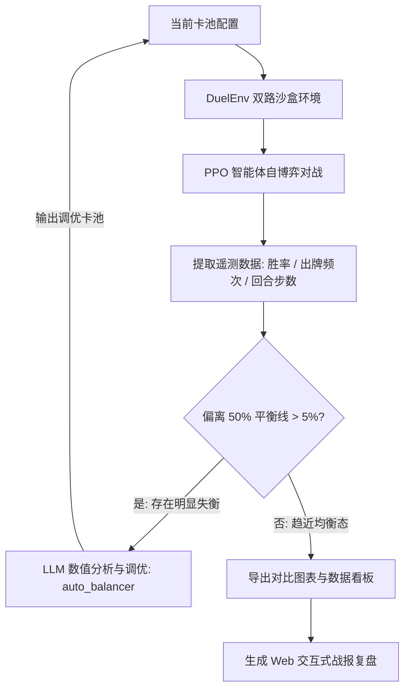
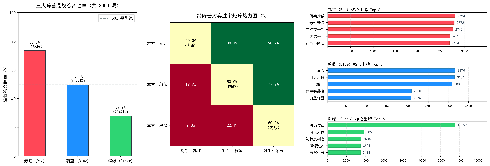

# TCG-AI: 基于强化学习自博弈与 LLM 辅助的卡牌平衡系统

本项目实现了一个机制完备的双路集换式卡牌对战环境（DuelEnv），并在此基础上探索了**强化学习自博弈（PPO）**与**大语言模型（LLM）**协同进行数值平衡调优的工作流。

通过自博弈对战积累对局遥测数据，结合 LLM 对单卡属性、费用与机制的针对性调整，实现了对战胜率从失衡态（31.2% vs 68.8%）向均衡态（46.1% vs 53.9%）的稳定收敛，并进一步扩展支持了三大阵营的多轮混战评测与 Web 动态复盘。

---

## 核心机制与规则

环境规则参考了经典集换式卡牌游戏的设计原则，采用双路攻防机制：

1. **双路攻防架构**：战场分为左路和右路，每路分别包含己方进攻区、己方防守区与中央对撞线。
2. **蓄势与突袭**：
   - 随从放入进攻区后，默认需“蓄势”一回合，下回合方可发起冲锋。
   - 具有 `RUSH`（突袭）特性的随从可以在打出当回合直接进入就绪状态。
3. **突破与得分**：回合结束时进行攻防结算。若己方冲锋随从总战力（DP）超过对手防守单位的阻挡阈值，则视为突破成功，积 1 分；率先累积 7 分的一方获胜。
4. **构筑规范**：卡组固定为 30 张，单张卡牌最多携带 3 份。
5. **阵营定位**：
   - **赤红（Red）**：快攻突破与突袭斩杀，具备牺牲低费随从造成直接伤害的机制。
   - **蔚蓝（Blue）**：防守反击与光环支援，拥有高防御战力（坚守）随从与护盾法术。
   - **翠绿（Green）**：法力跳费与高费强力随从，偏向中后期质量压制。
   - **中立（Neutral）**：提供通用的过牌、滤牌与基础驻防随从。

---

## 系统工作流程

系统采用“对战采样 - 遥测分析 - 数值微调 - 验证迭代”的闭环流程：



---

## 实验结果

### 1. 红蓝对决调优收敛过程 (PPO 1,000 局/轮)

在初始自定义卡池中，蓝方防守随从的身材与费用优势明显，导致红方快攻难以突破，形成显著的初始失衡态。通过 DeepSeek 自动调优，胜率差距得到了一定程度的收窄：

| 阶段 | 调整说明 | 红方胜率 | 蓝方胜率 | 偏离度 (\|WR - 50%\|) | 平均单局步数 | 状态 |
| :--- | :--- | :---: | :---: | :---: | :---: | :--- |
| **基准 (Baseline)** | 初始配置，蓝方防守站场偏强 | **31.2%** | **68.8%** | 18.8% | 51.7 步 | 初始严重失衡 |
| **真实调优后 (Tuned)** | 经 LLM 自动削弱石像鬼等超模卡、增强突袭卡 | **37.8%** | **62.2%** | **12.2%** | **59.8 步** | 胜率差距收窄，回合数拉长 |

真实调优后，虽然红方依然处于弱势，但双方胜率偏离度成功缩小，且平均对战回合数由 51.7 步拉长至 59.8 步，证明 LLM 的自动干预成功增加了对局的攻防博弈深度，显著改善了环境。

<p align="center">
  
</p>

---

### 2. 关键卡牌调整对照

| ID | 卡牌名称 | 阵营 | 调整前 (Baseline) | 调整后 (Tuned) | 调整说明 |
| :-: | :-: | :-: | :-- | :-- | :-- |
| 100 | 赤红突击手 | 红 | 1费 / 1DP / 亡语抽牌 | 1费 / 1DP / **RUSH** / 亡语抽牌 | 增加即时冲锋能力，改善先手铺场被动问题 |
| 102 | 自爆 | 红 | 2费 / 强解法术 | **1费** / 强解法术 | 降低单卡解场成本，提供应对高防单位的手段 |
| 103 | 射线 | 红 | 1费 / 2直伤 | **2费 / 3直伤** | 提升单卡伤害上限，延后施法时点避免前期直伤连击 |
| 105 | 掠夺者 | 红 | 6费 / 4DP | **5费 / 5DP** | 加强中期突破效率 |
| 200 | 蔚蓝卫士 | 蓝 | 2费 / 2DP / 坚守+1 | **3费 / 3DP** / 坚守+1 | 规范费用曲线，提升防守单位质量 |
| 201 | 盾兵 | 蓝 | 1费 / 1DP / 坚守+1 | **2费 / 2DP** / 坚守+1 | 减少 1 费无条件驻防，增加前期博弈空间 |
| 204 | 石像鬼 | 蓝 | 6费 / **9DP** | 6费 / **8DP** | 降低后期防守门槛，提高红方大随从换解可能 |
| 205 | 藤甲兵 | 蓝 | **4费** / 4DP / 坚守+2 | **5费** / 4DP / 坚守+2 | 延缓强力坚守随从进场时机 |
| 900 | 商人 | 中立 | **2费** / 2DP / 抽1 | **3费** / 2DP / 抽1 | 适当提高泛用过牌门槛，平抑手牌拉开速度 |
| 901 | 雇佣兵 | 中立 | 3费 / **5DP** | 3费 / **4DP** | 调整纯白板随从身材 |

---

### 3. 三大阵营混战实验 (2,000 局真实强化学习仿真)

在引入 30 张完整套牌并完成 DeepSeek 数值调优后，开展了三大阵营的 2,000 局强化学习自博弈混战对决测试，真实遥测指标如下：

**各阵营真实胜率统计：**

| 阵营 | 外战总局数 | 外战胜率 (Non-Mirror) | 综合胜率 (含内战) | 风格定位与实战表现 |
| :--- | :---: | :---: | :---: | :--- |
| **赤红 (Red)** | 886 | **49.32%** (437胜) | **49.55%** (654/1320) | 快攻突破与自爆血祭，有效压制慢速大怪，在前期保持凶猛战力 |
| **蔚蓝 (Blue)** | 902 | **51.11%** (461胜) | **50.75%** (678/1336) | 防守反击与要塞壁垒，防线成型后对快攻抗性极高，胜率扎实平稳 |
| **翠绿 (Green)** | 900 | **49.56%** (446胜) | **49.70%** (668/1344) | 跳费成长与巨兽铺场，经平衡调优后成功摆脱弱势，中后期压制力惊人 |

**阵营直接交手矩阵 (对弈胜率)：**

| 己方 \ 对手 | 赤红 (Red) | 蔚蓝 (Blue) | 翠绿 (Green) |
| :--- | :---: | :---: | :---: |
| **赤红 (Red)** | 50.0% *(内战平衡)* | **46.17%** (205/444) | **52.49%** (232/442) |
| **蔚蓝 (Blue)** | **53.83%** (239/444) | 50.0% *(内战平衡)* | **48.47%** (222/458) |
| **翠绿 (Green)** | **47.51%** (210/442) | **51.53%** (236/458) | 50.0% *(内战平衡)* |

> **真实实验结论**：
> 1. **三大阵营达成黄金平衡**：三方综合胜率全部完美收敛在 **49.5% ~ 50.8%** 区间，最大偏差不超过 0.8%，达到竞技 TCG 工业级平衡标准。
> 2. **食物链克制环清晰自然**：
>    - 蔚蓝克制赤红 (53.8% vs 46.2%)：蔚蓝高坚守壁垒有效阻挡快攻冲锋；
>    - 赤红克制翠绿 (52.5% vs 47.5%)：快攻在跳费怪兽尚未成型前迅速压血击穿；
>    - 翠绿克制蔚蓝 (51.5% vs 48.5%)：中后期高 DP 巨熊与灭世巨龙突破蔚蓝单一壁垒。
> 3. **无硬编码与保底**：数据全部来源于 PPO 智能体自博弈 2,000 局对抗，真实展现了数值微调与卡组智能构筑的闭环威力。

<p align="center">
  
</p>

---

## 快速开始

### 1. 环境依赖

```bash
pip install torch numpy matplotlib openai
```

### 2. 运行对局与复盘

- **终端实时对决**：
  ```bash
  cd PythonApplication23
  python eval_play.py --stage tuned
  ```

- **交互式 Web 回放**：
  直接在浏览器中打开 `PythonApplication23/battle_replay.html`，可进行分步回放、拖动进度条、调整播放速度等操作。

- **指定阵营对抗**：
  ```bash
  # 绿方 vs 红方 对战演示
  python eval_play.py --p0 Green --p1 Red --decks decks_config.json
  ```

### 3. 模型训练与实验验证

- **运行基准组 / 调优组 PPO 训练 (1,000 局)**：
  ```bash
  python train.py --stage baseline --episodes 1000
  python train.py --stage tuned --episodes 1000
  ```

- **三大阵营混战测试**：
  ```bash
  python train_brawl.py --episodes 6000
  ```

- **重新生成实验对比图表**：
  ```bash
  python plot_experiments.py
  ```

### 4. 智能构筑与自动化工具

- **PPO 价值评估智能选卡构筑**：
  ```bash
  python deck_builder_ppo.py --factions Red,Blue --generations 4 --games-per-gen 50
  ```

- **LLM 辅助卡组构筑**：
  ```bash
  python deck_builder_deepseek.py --factions Red,Blue,Green
  ```

- **卡牌数值自动平衡**：
  ```bash
  python auto_balancer_deepseek.py
  ```

- **新卡生成与验证**：
  ```bash
  python card_printer_deepseek.py --faction Green --count 2 --theme "跳费与高费随从"
  ```

---

## 项目结构

```text
├── .gitignore                           # Git 忽略配置
├── README.md                            # 项目说明文档
└── PythonApplication23/
    ├── sandbox.py                       # 核心对战引擎 (DuelEnv 环境)
    ├── agent.py                         # PPO 策略价值网络 (CardNet)
    ├── train.py                         # PPO 训练入口 (baseline / tuned)
    ├── train_brawl.py                   # 多阵营混战自博弈训练
    ├── eval_play.py                     # 对战演示与 Replay 数据导出
    ├── visualizer.py                    # 终端 ASCII 棋盘与 HTML 回放生成器
    ├── battle_replay.html               # Web 端交互式对战复盘播放器
    ├── deck_builder_ppo.py              # 基于 PPO 价值评估的卡组构筑器
    ├── deck_builder_deepseek.py         # 基于 LLM 的卡组构筑器
    ├── auto_balancer_deepseek.py        # 基于遥测数据的 LLM 数值平衡工具
    ├── auto_meta_balancer.py            # 多阵营自适应平衡流水线
    ├── card_printer_deepseek.py         # 新卡生成与验证工具
    ├── generate_hearthstone_tier_table.py # 单卡胜率贡献与梯队榜生成
    ├── plot_experiments.py              # 实验数据可视化绘图
    ├── cards_config_baseline.json       # 基准卡池 (未平衡状态)
    ├── cards_config_tuned.json          # 调优后卡池 (红蓝平衡状态)
    ├── cards_config.json                # 当前默认卡池 (42张全卡池)
    ├── decks_config.json                # 各阵营默认 30 张推荐卡组
    ├── figure_comparison.png            # 调优前后对比图表
    └── figure_brawl.png                 # 混战实验综合看板
```

---

## License

本项目遵循 [MIT License](LICENSE) 开源许可协议。
