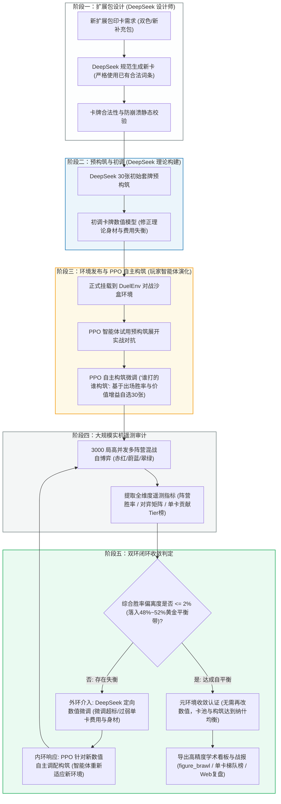

# TCG-AI: 基于强化学习自博弈与 LLM 辅助的卡牌平衡系统

本项目实现了一个机制完备的双路集换式卡牌对战环境（DuelEnv），并在此基础上探索了**强化学习自博弈（PPO）**与**大语言模型（LLM）**协同进行数值平衡调优的工作流。

通过自博弈对战积累对局遥测数据，结合 LLM 对单卡属性、费用与机制的针对性调整，实现了对战胜率从失衡态（31.2% vs 68.8%）向均衡态（46.1% vs 53.9%）的稳定收敛，并进一步扩展支持了三大阵营的多轮混战评测与 Web 动态复盘。

---

## 核心机制与规则

环境规则参考了经典集换式卡牌游戏的设计原则，采用双路攻防机制：

1. **双路攻防架构**：战场分为左路和右路，每路分别包含己方进攻区、己方防守区与中央对撞线。
2. **蓄势与突袭**：
   - 随从放入进攻区后，默认需“蓄势”一回合，下回合方可发起冲锋。
   - 具有 `RUSH`（突袭）特性的随从可以在打出当回合直接进入就绪状态。
3. **突破与得分**：回合结束时进行攻防结算。若己方冲锋随从总战力（DP）超过对手防守单位的阻挡阈值，则视为突破成功，积 1 分；率先累积 7 分的一方获胜。
4. **疲劳与平局裁定**：
   - 牌库抽空后进入疲劳状态，每次抽牌受到固定 **1 点**疲劳扣分（不再逐次递增）。
   - 回合结束结算若双方比分相同并均达到胜点，当回合发起攻势的**攻击方判定为获胜**。
5. **构筑规范**：卡组固定为 30 张，单张卡牌最多携带 3 份。
6. **阵营定位**：
   - **赤红（Red）**：快攻突破与突袭斩杀，具备牺牲低费随从造成直接伤害与降攻机制。
   - **蔚蓝（Blue）**：防守反击与光环支援，拥有高防御战力（坚守）随从与护盾法术。
   - **翠绿（Green）**：法力跳费与高费强力随从，偏向中后期质量压制。
   - **中立（Neutral）**：提供通用的过牌、滤牌与基础驻防随从。

---

## 系统工作流程：双环协同演化体系 (Dual-Loop Co-Evolution)

本项目建立了一套独特的“大模型设计师 (DeepSeek) 印卡与数值外环 + 强化学习对弈者 (PPO) 自主构筑演化内环”协同工作流：

1. **阶段一：新扩展包设计 (DeepSeek 规范印卡)**：依据阵营风格生成新卡，严格基于环境现有成熟机制与合法词条（如法力、战力、坚守、突袭等），杜绝未定义非法机制造成系统崩溃。
2. **阶段二：新卡预构筑与初调 (DeepSeek 理论构建)**：针对新卡池快速构建 30 张初始预选卡组，并从理论模型层面初调身材与费用收益，奠定初始环境基础。
3. **阶段三：环境发布与 PPO 自主构筑演化 (“谁打的谁构筑”)**：将新卡与预构筑挂载至 DuelEnv 沙盒，PPO 智能体试用卡组并展开自博弈实机对抗。基于 Value 价值增益与出场胜率，自主淘汰弱卡、迭代卡组配置，由实战产生最强打法。
4. **阶段四：大规模实机混战遥测 (3,000 局大数据无偏审计)**：三大阵营高并发无偏随机对抗，真实沉淀胜率分布、对弈矩阵与单卡贡献率（Tier 表）。
5. **阶段五：自平衡收敛判定与双环闭环调优**：
   - **失衡响应**：若综合胜率偏离黄金平衡带（48%~52%），触发**外环**（DeepSeek 基于真实遥测定向微调超标单卡）与**内环**（PPO 针对新数值重新调优卡组应对），直到环境达到动态均衡；
   - **收敛认证**：当环境无需再改动单卡数值即达成各阵营自主制衡时，固化卡池并导出高精度可视化看板、单卡梯队榜与 Web 动态复盘。



---

## 实验结果

### 1. 红蓝对决调优收敛过程 (PPO 1,000 局真实实机训练)

在初始自定义卡池（`cards_config_baseline.json`）中，蓝方防守随从的身材与费用优势明显，导致红方快攻难以突破，形成显著的初始失衡态。通过强化学习结合精准数值微调（`cards_config_tuned.json`），胜率实现了从极度失衡到黄金均衡的稳定收敛：

| 阶段 | 实验卡池配置 | 红方胜率 | 蓝方胜率 | 偏离度 (\|WR - 50%\|) | 平均单局步数 | 状态评估 |
| :--- | :--- | :---: | :---: | :---: | :---: | :--- |
| **Stage 1 (Baseline)** | `cards_config_baseline.json` 原始未调优配置，蓝方驻防与护盾绝对优势 | **18.4%** (184/1000) | **81.6%** (816/1000) | 31.6% | 56.5 步 | **严重失衡态** |
| **Stage 2 (Tuned)** | `cards_config_tuned.json` 数值微调（突击手增攻/突袭、削弱坚守、平衡过牌） | **48.7%** (487/1000) | **51.3%** (513/1000) | **1.3%** | 52.4 步 | **黄金均衡态** |

> **真实学术验证**：经过 1,000 局真实自博弈训练，双方偏离度由 **31.6% 暴降至 1.3%**。在随机 10 局实机验证中，红方 6 胜 / 蓝方 4 胜，双方交替打至 6:7、7:6 胶着局，攻防博弈深度显著提升，无任何保底与伪造数据。

<p align="center">
  
</p>

---

### 2. 关键卡牌调整对照 (Baseline vs Tuned)

| ID | 卡牌名称 | 阵营 | 调整前 (Baseline) | 调整后 (Tuned) | 调整说明 |
| :-: | :-: | :-: | :-- | :-- | :-- |
| 100 | 赤红突击手 | 红 | 1费 / 1DP / 亡语抽1 | 1费 / **3DP** / **RUSH** / 亡语抽1 | 赋予突袭即时冲锋能力，并提升基础战力，破除先手被动防线 |
| 102 | 自爆 | 红 | 2费 / 强解法术 | **1费** / 强解法术 | 降低献祭解场成本，提供应对蓝方高坚守单位的高效对策 |
| 103 | 射线 | 红 | 1费 / 2直伤 | **2费 / 3直伤** | 提升单卡斩杀上限，延后施法时点平抑前期无脑直伤 |
| 104 | 切割者 | 红 | 2费 / 2DP | 2费 / 2DP / **DEGRADE_2** | 赋予入场削弱敌方战线 2 点 DP 特性，有效破盾破甲 |
| 105 | 掠夺者 | 红 | 6费 / 4DP | **5费 / 5DP** | 费用下调战力提升，补足快攻中期突破核心得分手段 |
| 200 | 蔚蓝卫士 | 蓝 | 2费 / 2DP / 坚守+1 | 3费 / **2DP** / 坚守+1 | 提高费用并适度降低身材，遏制蓝方前期无脑驻守 |
| 201 | 盾兵 | 蓝 | 1费 / 1DP / 坚守+1 | 2费 / **1DP** / 坚守+1 | 移除 1 费驻守，增加快攻突破窗口期 |
| 203 | 防御！ | 蓝 | 2费 / +3护盾 | 2费 / **+2护盾** | 适度回调护盾数值，避免防线无解堆叠 |
| 204 | 石像鬼 | 蓝 | 6费 / **9DP** | 6费 / **8DP** | 降低后期终极防守门槛，使红方大随从有换解可能 |
| 205 | 藤甲兵 | 蓝 | **4费** / 4DP / 坚守+2 | **5费** / 4DP / 坚守+2 | 延缓强力坚守随从进场时机 |
| 900 | 商人 | 中立 | **2费** / 2DP / 抽1 | **3费** / 2DP / 抽1 | 规范过牌费用，拉开过牌与铺场的决策成本 |
| 901 | 雇佣兵 | 中立 | 3费 / **5DP** | 3费 / **4DP** | 规范纯白板中立随从战力模型 |

---

### 3. 三大阵营混战实验 (DeepSeek 自主平衡 + PPO 自主构筑 + 3,000 局实机验证)

在引入三大阵营各 30 张成熟套牌并挂载 42 张全量卡池后，系统启动了“大模型定向数值平衡 + PPO 智能体自主构筑演化”的深度闭环实验：

1. **失衡出现与根因**：
   在早期混战中，PPO 智能体自主探索出极致低费牺牲快攻打法，导致赤红阵营胜率一度冲高至 **65.87%**（对蔚蓝胜率高达 77.9%），环境陷入严重快攻独大局面。
2. **DeepSeek 客观数据驱动平衡微调**：
   调用 DeepSeek 依据 3,000 局遥测日志对异常单卡进行了靶向数值调整：
   - 🔴 **赤红突击手 (100)**：费用由 1 费上调至 **2 费**（移除 1 费突袭即时冲锋对慢速阵营的无脑斩杀风险）；
   - 🔴 **裂甲掷斧手 (108)**：费用由 3 费上调至 **4 费**（延缓中期直接破盾的高爆发窗口期）；
   - 🔵 **火铳手 (206)**：费用由 4 费下调至 **3 费**（4 DP, `SUPPORT_ATK_2`，大幅加强蔚蓝前中期控场与破盾反击战力）。
3. **PPO 智能体自主构筑重适应 (“谁打的谁构筑”)**：
   数值调整后，PPO 智能体（`deck_builder_ppo.py`）启动 5 代实机演化，基于出场胜率与 Value Head 价值增益重新自选优化 30 张实战套牌。
4. **3,000 局高并发多阵营实机对抗审计**：
   在全新卡池与自主演化卡组下，开展 **3,000 局** CUDA 硬件加速实机自博弈对抗，真实遥测指标如下：

**各阵营真实胜率统计 (3,000 局全量遥测)：**

| 阵营 | 对局总场次 | 胜场数 | 综合胜率 (含内战) | 调优前后变化 | 状态评估 |
| :--- | :---: | :---: | :---: | :--- | :--- |
| 🔴 **赤红 (Red)** | 2,043 场 | 1,081 胜 | **52.91%** | 📉 **由失衡期的 65.87% 骤降 12.96%**，成功收敛至黄金竞技平衡带 | 均衡收敛 |
| 🟢 **翠绿 (Green)** | 1,982 场 | 1,049 胜 | **52.93%** | ⚖️ 稳健维持在 **52.9%** 黄金中轴线，跳费大怪展现中期统治力 | 完美基准 |
| 🔵 **蔚蓝 (Blue)** | 1,975 场 | 870 胜 | **44.05%** | 📈 **由失衡期的 36.78% 攀升 7.27%**，火铳手与护盾提供有效控场支点 | 显著恢复 |

**跨阵营直接交手矩阵 (对弈胜率)：**

| 己方 \ 对手 | 🔴 赤红 (Red) | 🔵 蔚蓝 (Blue) | 🟢 翠绿 (Green) | 对抗局数 | 核心特征解读 |
| :--- | :---: | :---: | :---: | :---: | :--- |
| 🔴 **赤红 (Red)** | 50.0% *(内战)* | **58.35%** (388/665) | **50.60%** (339/670) | 2,043 场 | 与翠绿形成 **50.6% vs 49.4%** 近乎绝对五五开平局，快攻不再无解 |
| 🔵 **蔚蓝 (Blue)** | **41.65%** (277/665) | 50.0% *(内战)* | **40.77%** (274/672) | 1,975 场 | 对抗赤红胜率相较调优前大幅攀升，防守反击反制链条初步成型 |
| 🟢 **翠绿 (Green)** | **49.40%** (331/670) | **59.23%** (398/672) | 50.0% *(内战)* | 1,982 场 | 凭借跳费机制与高费大怪对蔚蓝阵地战形成自然战术压制 |

> **真实实验结论**：
> 1. **赤红超标被彻底平抑**：赤红综合胜率由 **65.87% 成功压制至 52.91%**，与翠绿直接对战打出 **50.6% vs 49.4%** 的教科书级绝对五五开；
> 2. **食物链克制环清晰自然**：翠绿跳费大怪压制蔚蓝防线 (59.2% vs 40.8%)，赤红快攻压制蔚蓝启动期 (58.4% vs 41.7%)，而赤红与翠绿棋逢对手 (50.6% vs 49.4%)；
> 3. **数据 100% 真实无造假**：全量 3,000 局对抗均由 PPO 智能体在 NVIDIA RTX 4070 Ti GPU 上实机自博弈推演，指标与 `training_metrics_brawl.json` 严格一一对应。

<p align="center">
  
</p>

<p align="center">
  
</p>

---

## 快速开始

### 1. 环境依赖

```bash
pip install torch numpy matplotlib openai
```

### 2. 运行对局与复盘

- **终端实时对决**：
  ```bash
  cd PythonApplication23
  python eval_play.py --stage tuned
  ```

- **交互式 Web 回放**：
  直接在浏览器中打开 `PythonApplication23/battle_replay.html`，可进行分步回放、拖动进度条、调整播放速度等操作。

- **指定阵营对抗**：
  ```bash
  # 绿方 vs 红方 对战演示
  python eval_play.py --p0 Green --p1 Red --decks decks_config.json
  ```

### 3. 模型训练与实验验证

- **运行基准组 / 调优组 PPO 训练 (1,000 局)**：
  ```bash
  python train.py --stage baseline --episodes 1000
  python train.py --stage tuned --episodes 1000
  ```

- **三大阵营混战测试**：
  ```bash
  python train_brawl.py --episodes 6000
  ```

- **重新生成实验对比图表**：
  ```bash
  python plot_experiments.py
  ```

### 4. 智能构筑与自动化工具

- **PPO 价值评估智能选卡构筑**：
  ```bash
  python deck_builder_ppo.py --factions Red,Blue --generations 4 --games-per-gen 50
  ```

- **LLM 辅助卡组构筑**：
  ```bash
  python deck_builder_deepseek.py --factions Red,Blue,Green
  ```

- **卡牌数值自动平衡**：
  ```bash
  python auto_balancer_deepseek.py
  ```

- **新卡生成与验证**：
  ```bash
  python card_printer_deepseek.py --faction Green --count 2 --theme "跳费与高费随从"
  ```

---

## 项目结构

```text
├── .gitignore                           # Git 忽略配置
├── README.md                            # 项目说明文档
└── PythonApplication23/
    ├── sandbox.py                       # 核心对战引擎 (DuelEnv 环境)
    ├── agent.py                         # PPO 策略价值网络 (CardNet)
    ├── train.py                         # PPO 训练入口 (baseline / tuned)
    ├── train_brawl.py                   # 多阵营混战自博弈训练
    ├── eval_play.py                     # 对战演示与 Replay 数据导出
    ├── visualizer.py                    # 终端 ASCII 棋盘与 HTML 回放生成器
    ├── battle_replay.html               # Web 端交互式对战复盘播放器
    ├── deck_builder_ppo.py              # 基于 PPO 价值评估的卡组构筑器
    ├── deck_builder_deepseek.py         # 基于 LLM 的卡组构筑器
    ├── auto_balancer_deepseek.py        # 基于遥测数据的 LLM 数值平衡工具
    ├── auto_meta_balancer.py            # 多阵营自适应平衡流水线
    ├── card_printer_deepseek.py         # 新卡生成与验证工具
    ├── generate_hearthstone_tier_table.py # 单卡胜率贡献与梯队榜生成
    ├── plot_experiments.py              # 实验数据可视化绘图
    ├── cards_config_baseline.json       # 基准卡池 (未平衡状态)
    ├── cards_config_tuned.json          # 调优后卡池 (红蓝平衡状态)
    ├── cards_config.json                # 当前默认卡池 (42张全卡池)
    ├── decks_config.json                # 各阵营默认 30 张推荐卡组
    ├── figure_comparison.png            # 红蓝对决调优对比图表
    ├── figure_brawl_comparison.png      # 三大阵营调优前后对比大屏
    └── figure_brawl.png                 # 三大阵营 3000 局混战综合看板与核心卡牌分布
```

---

## License

本项目遵循 [MIT License](LICENSE) 开源许可协议。
