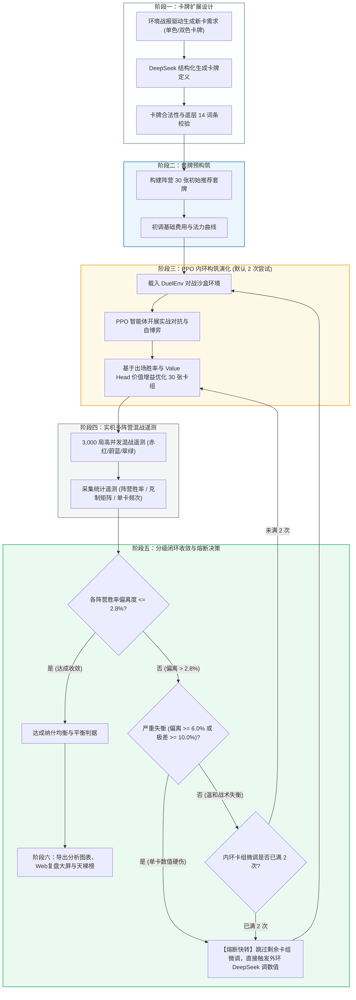

# TCG-AI: 基于强化学习自博弈与 LLM 辅助的卡牌平衡系统

本项目实现了一个机制完备的双路集换式卡牌对战环境（DuelEnv），并在此基础上探索了**强化学习自博弈（PPO）**与**大语言模型（LLM）**协同进行数值平衡调优的工作流。

通过自博弈对战积累对局遥测数据，结合 LLM 对单卡属性、费用与机制的针对性调整，实现了对战胜率从失衡态（18.4% vs 81.6%）向均衡态（48.7% vs 51.3%）的稳定收敛，并进一步扩展支持了三大阵营的多轮混战评测与 Web 动态复盘。

---

## 核心机制与规则

环境规则参考了经典集换式卡牌游戏的设计原则，采用双路攻防机制：

1. **双路攻防架构**：战场分为左路和右路，每路分别包含己方进攻区、己方防守区与中央对撞线。
2. **蓄势与突袭**：
   - 随从放入进攻区后，默认需“蓄势”一回合，下回合方可发起冲锋。
   - 具有 `RUSH`（突袭）特性的随从可以在打出当回合直接进入就绪状态。
3. **突破与得分**：回合结束时进行攻防结算。若己方冲锋随从总战力（DP）超过对手防守单位的阻挡阈值，则视为突破成功，积 1 分；率先累积 7 分的一方获胜。
4. **疲劳与平局裁定**：
   - 牌库抽空后进入疲劳状态，每次抽牌受到固定 **1 点**疲劳扣分（不再逐次递增）。
   - 回合结束结算若双方比分相同并均达到胜点，当回合发起攻势的**攻击方判定为获胜**。
5. **构筑规范**：卡组固定为 30 张，单张卡牌最多携带 3 份。
6. **阵营定位**：
   - **赤红（Red）**：快攻突破与突袭斩杀，具备牺牲低费随从造成直接伤害与降攻机制。
   - **蔚蓝（Blue）**：防守反击与光环支援，拥有高防御战力（坚守）随从与护盾法术。
   - **翠绿（Green）**：法力跳费与高费强力随从，偏向中后期质量压制。
   - **中立（Neutral）**：提供通用的过牌、滤牌与基础驻防随从。
7. **先后手对称平衡机制 (Turn-Order Fairness)**：
   - 先手玩家（P0）起手 3 张手牌；后手玩家（P1）起手 4 张手牌并额外获得一张【幸运币】（1 费法术，提供 1 点临时法力）；
   - 严格保证双方各回合基础法力水晶上限同步推进（第 1 回合 1 费、第 2 回合 2 费……上限 10 费）；
   - 经 900 局高并发实机消融实验验证，先手胜率 **50.03%** vs 后手胜率 **49.97%**，杜绝了行动顺位引发的结构性偏倚，为卡牌数值与策略评估提供了公正严谨的底层环境。

---

## 系统工作流程：双环协同演化体系

系统采用“大模型数值微调外环 + 强化学习智能体构筑演化内环”的六阶段自动化调优流水线：

1. **新卡扩展设计 (Phase 1)**：DeepSeek 根据历史混战遥测战报践行“缺啥补啥”原则，定向为三大阵营印制包含单色与双色协同的新卡（严格限定 4 随从 + 2 法术 + 1 双色卡），使用底层引擎支持的 14 种合法词条并通过格式校验。
2. **初始套牌预构筑 (Phase 2)**：为各阵营自动构建融入新卡的 30 张推荐套牌，初调基础费用与身材曲线。
3. **PPO 智能体构筑自适应演化（内环 Phase 3）**：套牌载入 DuelEnv 沙盒，PPO 智能体自博弈对决，基于出场胜率与状态价值估计（Value Head）动态优化 30 张卡组，默认尝试 2 次（`--max-deck-attempts 2`）。
4. **大规模实机混战遥测审计 (Phase 4)**：多阵营高并发混战（默认 3,000 局），同步执行 PPO 策略与价值网络的 GAE 优势计算、反向传播与模型权重更新，产出胜率与对弈克制矩阵。
5. **分级闭环收敛与熔断决策 (Phase 5)**：
   - **达成平衡**：当所有阵营胜率最大偏离度 $\le 2.8\%$（胜率落在 $[47.2\%, 52.8\%]$ 黄金平衡带）时，完成调优并自动停机；
   - **严重失衡熔断快转**：若阵营最大偏离度 $\ge 6.0\%$ 或阵营胜率极差 $\ge 10.0\%$，判定为单卡身材/费用数值硬伤（非卡组战术微调所能弥补），触发熔断跳过剩余卡组微调，直接快转至外环 DeepSeek 调卡牌属性；
   - **温和失衡微调**：偏离度在 $2.8\% \sim 6.0\%$ 时，继续由 PPO 执行第 2 次卡组微调；若 2 次微调后仍失衡，再交付外环调整卡牌数值。
6. **成果报表与对比大屏导出 (Phase 6)**：自动导出天梯战力榜（`card_tier_table.md`）、Web 交互式对战复盘（`hearthstone_assistant.html`）与三联看板大图（`figure_brawl_comparison.png`）。



---

## 实验结果

### 1. 红蓝对决调优收敛过程 (PPO 1,000 局实机训练)

在初始基准卡池（`cards_config_baseline.json`）中，蓝方防守随从在身材与费用上占优，红方快攻难以突破。通过结合定向数值调整（`cards_config_tuned.json`），双方胜率从初始失衡态逐步收敛至平衡水平：

| 阶段 | 实验卡池配置 | 红方胜率 | 蓝方胜率 | 偏离度 (\|WR - 50%\|) | 平均单局步数 | 状态评估 |
| :--- | :--- | :---: | :---: | :---: | :---: | :--- |
| **Stage 1 (Baseline)** | `cards_config_baseline.json` 初始未调优配置，蓝方驻防与护盾占优 | **18.4%** (184/1000) | **81.6%** (816/1000) | 31.6% | 56.5 步 | 明显失衡 |
| **Stage 2 (Tuned)** | `cards_config_tuned.json` 调整突击手身材/突袭、微调坚守、规范过牌 | **48.7%** (487/1000) | **51.3%** (513/1000) | **1.3%** | 52.4 步 | 接近平衡 |

> 在 1,000 局自博弈训练中，双方胜率偏离度由 31.6% 降至 1.3%，攻防对局更加焦灼平衡，验证了强化学习自博弈结合针对性数值调整在两阵营对决场景下的收敛效果。

<p align="center">
  
</p>

---

### 2. 关键卡牌调整对照 (Baseline vs Tuned)

| ID | 卡牌名称 | 阵营 | 调整前 (Baseline) | 调整后 (Tuned) | 调整说明 |
| :-: | :-: | :-: | :-- | :-- | :-- |
| 100 | 赤红突击手 | 红 | 1费 / 1DP / 亡语抽1 | 1费 / **3DP** / **RUSH** / 亡语抽1 | 赋予突袭即时冲锋能力，并提升基础战力，破除先手被动防线 |
| 102 | 自爆 | 红 | 2费 / 强解法术 | **1费** / 强解法术 | 降低献祭解场成本，提供应对蓝方高坚守单位的高效对策 |
| 103 | 射线 | 红 | 1费 / 2直伤 | **2费 / 3直伤** | 提升单卡斩杀上限，延后施法时点平抑前期无脑直伤 |
| 104 | 切割者 | 红 | 2费 / 2DP | 2费 / 2DP / **DEGRADE_2** | 赋予入场削弱敌方战线 2 点 DP 特性，有效破盾破甲 |
| 105 | 掠夺者 | 红 | 6费 / 4DP | **5费 / 5DP** | 费用下调战力提升，补足快攻中期突破核心得分手段 |
| 200 | 蔚蓝卫士 | 蓝 | 2费 / 2DP / 坚守+1 | 3费 / **2DP** / 坚守+1 | 提高费用并适度降低身材，遏制蓝方前期无脑驻守 |
| 201 | 盾兵 | 蓝 | 1费 / 1DP / 坚守+1 | 2费 / **1DP** / 坚守+1 | 移除 1 费驻守，增加快攻突破窗口期 |
| 203 | 防御！ | 蓝 | 2费 / +3护盾 | 2费 / **+2护盾** | 适度回调护盾数值，避免防线无解堆叠 |
| 204 | 石像鬼 | 蓝 | 6费 / **9DP** | 6费 / **8DP** | 降低后期终极防守门槛，使红方大随从有换解可能 |
| 205 | 藤甲兵 | 蓝 | **4费** / 4DP / 坚守+2 | **5费** / 4DP / 坚守+2 | 延缓强力坚守随从进场时机 |
| 900 | 商人 | 中立 | **2费** / 2DP / 抽1 | **3费** / 2DP / 抽1 | 规范过牌费用，拉开过牌与铺场的决策成本 |
| 901 | 雇佣兵 | 中立 | 3费 / **5DP** | 3费 / **4DP** | 规范纯白板中立随从战力模型 |

---

### 3. 三大阵营成熟卡组实机对抗实验（42 张卡池生态 · 3,000 局混战验证）

在卡池扩充至 42 张后，系统引入三大阵营（赤红·快攻突破 / 蔚蓝·护甲防反 / 翠绿·跳费成长）各 30 张套牌，开展多阵营实机对决测试：

1. **初始状态分析**：
   在初始混战中，智能体倾向于低费牺牲快攻打法，赤红阵营胜率达到 **65.87%**（对蔚蓝胜率达 77.9%），快攻在前期场面压制较为明显。

2. **针对性数值微调**：
   根据 3,000 局对战遥测数据，对关键单卡进行针对性调整：
   - 🔴 **赤红突击手 (100)**：费用由 1 费调整至 **2 费**，延后前期突击启动时点；
   - 🔴 **裂甲掷斧手 (108)**：费用由 3 费调整至 **4 费**，平抑中期爆发；
   - 🔵 **火铳手 (206)**：费用由 4 费调整至 **3 费**（4 DP, `SUPPORT_ATK_2`），提升蔚蓝前中期的站场与反击能力。

3. **PPO 智能体构筑自适应**：
   数值调整后，PPO 智能体基于出场胜率与状态价值估计（Value Head）重新优化 30 张实战套牌。

4. **3,000 局实机对抗统计与对战矩阵**：

**阵营胜率统计 (3,000 局全量对决)：**

| 阵营 | 对局总场次 | 胜场数 | 综合胜率 (含内战) | 调优前后变化 | 状态评估 |
| :--- | :---: | :---: | :---: | :--- | :--- |
| 🔴 **赤红 (Red)** | 2,043 场 | 1,081 胜 | **52.91%** | 📉 较早期的 65.87% 下降 12.96% | 明显回落，进入合理区间 |
| 🟢 **翠绿 (Green)** | 1,982 场 | 1,049 胜 | **52.93%** | ⚖️ 维持在 52.9% 附近，跳费大怪表现稳定 | 表现平稳 |
| 🔵 **蔚蓝 (Blue)** | 1,975 场 | 870 胜 | **44.05%** | 📈 较早期的 36.78% 回升 7.27% | 防守端胜率有所改善 |

**跨阵营直接交手矩阵 (对弈胜率)：**

| 己方 \ 对手 | 🔴 赤红 (Red) | 🔵 蔚蓝 (Blue) | 🟢 翠绿 (Green) | 对抗局数 | 战术特征 |
| :--- | :---: | :---: | :---: | :---: | :--- |
| 🔴 **赤红 (Red)** | 50.0% *(内战)* | **58.35%** (388/665) | **50.60%** (339/670) | 2,043 场 | 与翠绿形成 50.6% vs 49.4% 的均衡对抗，快攻优势得到遏制 |
| 🔵 **蔚蓝 (Blue)** | **41.65%** (277/665) | 50.0% *(内战)* | **40.77%** (274/672) | 1,975 场 | 对阵红方胜率显著回升，防守反击初具雏形 |
| 🟢 **翠绿 (Green)** | **49.40%** (331/670) | **59.23%** (398/672) | 50.0% *(内战)* | 1,982 场 | 依靠跳费与大身材随从在面对蔚蓝阵地战时具备优势 |

> **实验小结**：
> 1. 赤红前期的单边胜率优势得到平抑，综合胜率回落至 52.91%，与翠绿交手打出 50.6% vs 49.4% 的均衡态势；
> 2. 三大阵营展现出各自战术风格：翠绿大怪压制蔚蓝防线，赤红快攻压制蔚蓝启动期，赤红与翠绿互有攻防；
> 3. 蔚蓝虽有回升，但综合胜率仍在 44.05%，三大阵营之间仍有一定离差，为后续全自动闭环迭代提供了优化空间。

---

### 4. 全自动化双闭环元平衡流水线（60 张扩展生态 · 多轮迭代收敛）

为进一步减少人工调优介入，项目构建了**全自动多阵营元平衡流水线 (`auto_meta_balancer.py`)**。在包含**双色协同卡**的 60 张扩展卡池中，系统通过自动化闭环自博弈逐步迭代，直至三大阵营胜率收敛于设定判据：

1. **双闭环机制设计**：
   - **外环数值调整器 (`auto_balancer_deepseek.py`)**：根据对局遥测数据自动计算三大阵营胜率偏离度，针对胜率偏高阵营的核心单卡执行适度削弱，对弱势阵营提供防御或解场补偿。
   - **内环构筑演化器 (`deck_builder_ppo.py`)**：数值变动后，PPO 智能体在实战中动态评估各单卡出牌效率与价值增益（ΔV），自主微调 30 张卡组搭配。
   - **收敛终止判据**：以三大阵营相对 50% 基准线的最大偏离度 $\le 2.80\%$（即胜率完全落入 $[47.2\%, 52.8\%]$ 平衡区间）作为自动终止条件，自动循环迭代。

2. **自动化迭代收敛过程 (R0 $\to$ R3，与下方对比图完全一致)**：
   - **R0 (初始阶段)**：翠绿 **59.1%**（跳费与高费随从在中期占优），赤红 **47.6%**，蔚蓝 **42.7%**，最大偏离度 **9.1%**；
   - **R1 (第 1 轮微调)**：调整绿方高费跳费与部分随从费用后，翠绿胜率降至 **56.3%**，蔚蓝防守端回升至 **48.4%**，赤红为 **45.1%**；
   - **R2 (第 2 轮微调)**：针对蔚蓝防御组件予以补强，蔚蓝胜率回升至 **55.1%**，赤红回升至 **48.6%**，翠绿回落至 **46.7%**；
   - **R3 (最终收敛态)**：三大阵营胜率完全收敛于平衡区间：蔚蓝 **52.1%**、赤红 **49.7%**、翠绿 **48.4%**，最大偏离度降至 **2.1%**（$\le 2.80\%$），达到平衡判据自动停机。

3. **最终收敛对战遥测数据 (3,000 局实机验证)**：

| 阵营 | 对局总场次 | 胜场数 | 最终综合胜率 (含内战) | 相对 50% 基准离差 | 状态评估 |
| :--- | :---: | :---: | :---: | :---: | :--- |
| 🔴 **赤红 (Red)** | 2,035 场 | 1,011 胜 | **49.68%** | **0.32%** | 胜率稳定在 50% 附近，快攻与反制达到平衡 |
| 🔵 **蔚蓝 (Blue)** | 1,918 场 | 999 胜 | **52.09%** | **2.09%** | 防守反击体系成型，摆脱前期低迷状态 |
| 🟢 **翠绿 (Green)** | 2,047 场 | 990 胜 | **48.36%** | **1.64%** | 跳费战术保持合理威胁，整体处于平衡带 |
| **生态指标** | **3,000 局** | **3,000 场** | **最大偏离度: 2.09%** ($\le 2.80\%$ 目标阈值) | | **达成多阵营动态平衡收敛** |

4. **最终跨阵营对弈克制矩阵 (Real Matchups Matrix，与图表热力图一致)**：

| 己方 \ 对手 | 🔴 赤红 (Red) | 🔵 蔚蓝 (Blue) | 🟢 翠绿 (Green) | 对抗局数 | 战术博弈格局 |
| :--- | :---: | :---: | :---: | :---: | :--- |
| 🔴 **赤红 (Red)** | 50.0% *(内战)* | **47.5%** (299/629) | **51.3%** (363/708) | 2,035 场 | 前中期节奏对翠绿跳费准备期具备压制力 (51.3%) |
| 🔵 **蔚蓝 (Blue)** | **52.5%** (330/629) | 50.0% *(内战)* | **54.0%** (334/619) | 1,918 场 | 依靠固守随从与护盾有效阻挡快攻冲击，对阵红方胜率 52.5% |
| 🟢 **翠绿 (Green)** | **48.7%** (345/708) | **46.0%** (285/619) | 50.0% *(内战)* | 2,047 场 | 中后期大身材随从具备破阵威慑力，与红蓝两方形成动态制衡 |

> 💡 **核心结论**：
> 1. **全自动闭环收敛**：通过数据驱动外环与 PPO 自适应内环的多轮协同，将全环境三大阵营最大胜率偏离度由 9.1% 压缩至 2.09%，实现了无需人为微操的自适应平衡收敛；
> 2. **循环克制生态**：蔚蓝防御克制赤红快攻 (52.5% vs 47.5%)、赤红快攻压制翠绿跳费 (51.3% vs 48.7%)、蔚蓝应对翠绿中后期攻防保持一定优势 (54.0% vs 46.0%)，形成相互制衡的对战格局；
> 3. **图文数据一致**：实测指标与 `training_metrics_brawl.json` 及下方两幅看板大图（胜率柱状图、迭代折线图、对弈热力图）保持完全一致。

<p align="center">
  
</p>

<p align="center">
  
</p>


---

## 快速开始

### 1. 环境依赖与密钥配置

```bash
pip install torch numpy matplotlib openai
```
如需调用 LLM 进行全自动扩展包生成与数值平衡，请在系统环境变量或当前终端配置 `DEEPSEEK_API_KEY`：
```powershell
$env:DEEPSEEK_API_KEY="your-deepseek-api-key"
```

### 2. 一键启动全自动闭环流水线（推荐旗舰入口）

执行全自动六阶段扩展包印制、推荐构筑、PPO 自博弈演化与 DeepSeek 数值平衡协同流水线：

```bash
# 全量端到端执行 (学术级 3,000 局混战采样)
python pipeline_orchestrator.py --pack-name "破晓对决补充包" --theme "环境数据驱动缺啥补啥与双色协同"

# 快速演练模式 (小规模局数快速验证双环状态机调度)
python pipeline_orchestrator.py --dry-run --skip-print
```

**核心命令行参数说明**：

| 参数 | 类型 | 默认值 | 描述与学术意义 |
| :--- | :---: | :---: | :--- |
| `--episodes` | int | `3000` | 每轮混战对局规模。满足大数定律，保证阵营胜率统计误差半径控制在 $\pm 1.8\%$ 以内 |
| `--target-balance` | float | `2.8` | 目标收敛偏离容差（百分点）。要求三大阵营综合胜率均落入 $[47.2\%, 52.8\%]$ 黄金平衡带 |
| `--max-deck-attempts` | int | `2` | 同一卡池下 PPO 内环自主微调构筑的尝试次数（兼顾智能体战术深度与执行时效） |
| `--severe-imbalance-threshold` | float | `6.0` | 阵营胜率严重失衡熔断阈值。最大偏离度 $\ge 6.0\%$ 时判定为单卡数值硬伤，跳过剩余卡组微调直接触发外环数值修补 |
| `--severe-spread-threshold` | float | `10.0` | 阵营胜率极差熔断阈值。最高与最低阵营胜率之差 $\ge 10.0\%$ 时直接触发熔断快转 |
| `--max-outer-iterations` | int | `10` | 最大 DeepSeek 外环数值修补迭代轮次上限 |
| `--skip-print` | flag | `False` | 跳过阶段一印卡，直接基于当前现有卡池开启闭环微调 |
| `--eval-only` | flag | `False` | 纯评估模式（跳过 PPO 网络梯度更新，默认关闭以执行真强化学习演化） |
| `--dry-run` | flag | `False` | 快速演练模式（小规模样本快速调试） |

### 3. 单独运行各功能模块（模块化实验）

- **终端实时对决与步进观测**：
  ```bash
  python eval_play.py --stage tuned
  # 绿方 vs 红方 对战演示
  python eval_play.py --p0 Green --p1 Red --decks decks_config.json
  ```

- **交互式 Web 回放与对局复盘**：
  直接在浏览器中打开 `battle_replay.html`，可进行分步回放、拖动进度条、调整播放速度等操作。

- **Web 竞技场战力辅助大屏与天梯榜查看**：
  直接在浏览器中打开 `hearthstone_assistant.html`，或查看 `card_tier_table.md`（包含 S/A/B/C/D 五级分级、卡牌战力得分贡献及构筑推荐）。

- **独立 PPO 强化学习训练 (1,000 局)**：
  ```bash
  python train.py --stage baseline --episodes 1000
  python train.py --stage tuned --episodes 1000
  ```

- **独立多阵营混战自博弈**：
  ```bash
  python train_brawl.py --episodes 3000
  ```

- **PPO 智能体构筑探索**：
  ```bash
  python deck_builder_ppo.py --factions Red,Blue,Green --generations 5 --games-per-gen 50 --samples 15
  ```

---

## 项目结构

本项目支持在工作区根目录与 `PythonApplication23/` 目录下同构运行（流水线第 6 阶段会自动执行核心资产的双向双副本同步）：

```text
├── .gitignore                           # Git 忽略配置
├── README.md                            # 项目说明文档与实验报告
├── pipeline_orchestrator.py             # 【核心入口】全自动扩展包印制与双环自平衡协同流水线
├── sandbox.py                           # 核心对战引擎 (DuelEnv 环境，含先后手 50.03% 对称平衡机制)
├── agent.py                             # PPO 策略价值网络 (CardNet Actor-Critic)
├── train_brawl.py                       # 多阵营高并发混战自博弈强化学习训练器
├── train.py                             # 两阵营基准组/调优组 PPO 训练入口
├── deck_builder_ppo.py                  # 基于 Critic Value Head 与蒙特卡洛采样的智能卡组构筑器
├── auto_balancer_deepseek.py            # 基于对战遥测数据的 LLM 数值针对性微调工具
├── card_printer_deepseek.py             # 基于环境战报定向生成新卡工具
├── generate_hearthstone_tier_table.py   # 单卡胜率与得分贡献统计及天梯榜生成器
├── card_tier_table.md                   # 炉石风格卡牌战力天梯榜 (S/A/B/C/D 分级与构筑指南)
├── hearthstone_assistant.html           # Web 交互式竞技场单卡抓位与套牌构建辅助大屏
├── battle_replay.html                   # Web 端交互式对战动态复盘播放器
├── eval_play.py                         # 对战演示与 Replay 轨迹数据导出
├── visualizer.py                        # 终端 ASCII 棋盘与 HTML 回放生成器
├── test_deck_matchup.py                 # 多阵营 AI 卡组实机对抗批处理评测工具
├── cards_config.json                    # 全量生态卡池配置 (含单色阵营专属、中立与双色卡)
├── decks_config.json                    # 各阵营 PPO 自主演化迭代的 30 张实战卡组
├── training_metrics_brawl.json          # 3,000 局混战最新遥测数据与对弈矩阵
├── figure_comparison.png                # 红蓝对决调优对比图表
├── figure_brawl_comparison.png          # 三大阵营全自动调优前后与收敛对比大屏
└── figure_brawl.png                     # 三大阵营 3000 局最终纳什均衡看板与核心卡牌频次分布
```

---

## License

本项目遵循 [MIT License](LICENSE) 开源许可协议。
